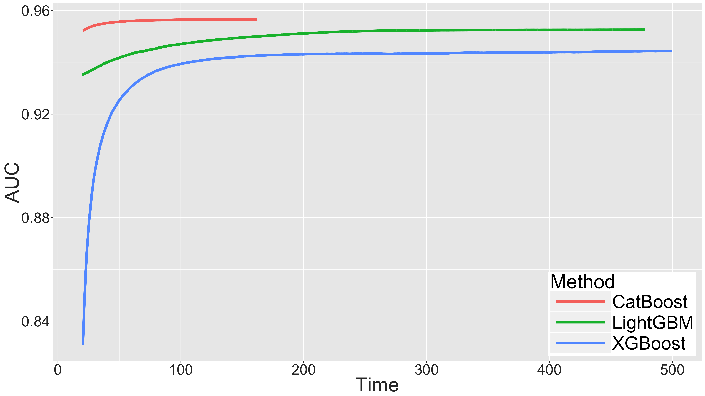

# Experiments

## CPU vs GPU comparison

For CPU version we used dual-socket server with 2 Intel~Xeon CPU (E5-2650v2,~2.60GHz) and 256GB RAM and run CatBoost with 32 threads (equal to number of logical cores). For GPU we used several modern NVIDIA accelerators.

We used [Epsilon dataset](https://www.csie.ntu.edu.tw/~cjlin/libsvmtools/datasets/binary.html) (400К samples, 2000 features) to benchmark our performance on dense numerical dataset. For dense numerical dataset CatBoost GPU training time depends on level of feature discretization. In the table we report time for default 128 bins and for 32 bins which is often sufficient. For the best performance and the lowest memory usage one try to use 15 bins.

|            | 128 bins   | 32 bins   |            
|:-----------|:-----------|:----------|
| CPU        | 713 (1.0)  | 653 (1.0) | 
| K40        | 547 (1.3)  | 248 (2.6) | 
| GTX 1080   | 194 (3.67) | 120 (5.4) | 
| P40        | 162 (4.4)  | 91 (7.1)  | 
| GTX 1080Ti | 145 (4.9)  | 88 (7.4)  | 
| P100-PCI   | 127 (5.6)  | 70 (9.3)  | 
| V100-PCI   | 77 (9.25)  | 49 (13.3) | 

We used [Criteo dataset](https://www.kaggle.com/c/criteo-display-ad-challenge) (first 36M samples, 26 categorical, 13 numerical features) to benchmark our categorical features support. We used 2 GTX1080 because 1 did not have enough memory.

|            | 128 bins   |
|:-----------|:-----------|
| CPU        | 1060 (1.0) |
| K40        | 373 (2.84) |
| GTX 1080   | 285 (3.7)  |
| P40        | 123 (8.6)  |
| GTX 1080Ti | 301 (3.5)  |
| P100-PCI   | 82 (12.9)  |
| V100-PCI   | 69.8 (15)  |

## Comparison with XGBoost and LightGBM

We use Epsilon dataset (400K samples for train, 100K samples for test) to  give some insights of how fast our GPU implementation could train a model of fixed size. For this dataset we measure mean tree construction time one can achieve without using feature subsampling and/or bagging by CatBoost and 2 open-source implementations of boosting with GPU support:  XGBoost (we use histogram-based version, exact version is very slow) and LightGBM. We run all experiments on the same machines with NVIDIA P100 accelerator, dual-core Intel Xeon E5-2660 CPU and 128GB RAM.  For XGBoost and CatBoost we use default tree depth equal to 6, for LightGBM we set leafs count to 64 to have more comparable results. We set bin count to 15 for all 3 methods. Such bin count gives the best performance and  the lowest memory usage for LightGBM and CatBoost (Using 128-255 bin count usually leads both algorithms to run 2-4 times slower). For XGBoost we could use even smaller bin count but performance gains compared to 15 bins are too small to account for. All algorithms were run with 16 threads, which is equal to hardware core count. By default CatBoost uses bias-fighting scheme described in section~\ref{sec:fighting}. This scheme is by design 2-3 times slower then classical boosting approach. GPU implementation of CatBoost contains a mode based on classic scheme for those who need best training performance, in this benchmark we used the classic scheme.

We set such learning rate that algorithms start to overfit approximately after 8000 trees. We measure time to train ensembles of 8000 trees. Mean tree construction time for CatBoost was 17.9ms, for XGBoost 488ms, for LightGBM 40ms. These times are very rough speed comparison, because training time of one tree construction depends on distribution of features and ensemble size. At the same times it shows that if we have similar size ensembles we could expect CatBoost and LightGBM to be competitors for the fastest method, while XGBoost is significantly slower than both of them.

Learning curves for algorithms:

### GPU training scripts
Scripts to run GPU versions of XGBoost, LightGBM, CatBoost, compute quality metrics (and their plots) for trained models and extract learning time from logs.

run_experiment_*.py scripts just perform training with different values of regularization (shrinkage/step) and use auto-stop to find best iteration (round). After that scripts measure time which we need to learn the ensemble of desired size and computes table with columns (best_tree_count, score, time_to_learn_best_tree_count).

extract_scores_*.py scripts were used to parse one experiment logs and take time/quality statistics from them.
