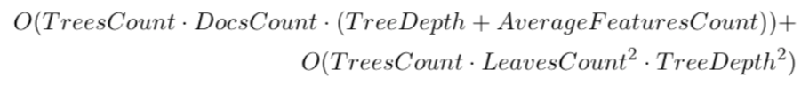
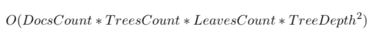

# [SHAP](https://arxiv.org/abs/1705.07874) values comparison

**Introduction**

In this benchmark we evaluated the shap values calculation performance for different gradient boosting libraries. The original paper about shap values you could find [here](https://arxiv.org/abs/1802.03888) and the official implementation [here](https://github.com/slundberg/shap).
	
Let us briefly overview the asymptotic analysis for different libraries.
	
Catboost:
	

where AverageFeatureCount is an average number of features over all trees which could be found in a tree.

XGBoost and LightGBM:

**Experiment infrastructure**: 

* GPU: Titan X Pascal (used only for training)
* Intel(R) Xeon(R) CPU E5-2683 v3 @ 2.00GHz 
	
We trained models on GPU but all evaluations were done on CPU.

**Parameters**

We run experiments on different depths and test sizes for each 	library. ``max bin`` parameter was set up to 128 and 	other parameters were default for every library.
	
**Dataset**

We used [Epsilon dataset](https://www.csie.ntu.edu.tw/~cjlin/libsvmtools/datasets/binary.html) (400К samples| 2000 features) to benchmark our performance on dense numerical dataset.
	
		
**Results**

Time in table is given in seconds and we didn't take into account time for data preprocessing.

depth|test size|catboost|lightgbm|xgboost|
:--------|:----|:-------|:-------|:------|
2|1000|0.34|0.15|**0.12**|
2|5000|1.18|0.33|**0.27**
2|10000|2.20|**0.57**|0.61
4|1000|**0.31**|0.61|0.35
4|5000|**1.08**|2.42|1.17
4|10000|2.25|4.44|**2.23**
6|1000|**0.60**|4.60|1.61
6|5000|**1.34**|22.16|7.37
6|10000|**2.42**|43.58|14.32
8|1000|**5.36**|25.36|8.66
8|5000|**6.08**|123.64|41.76
8|10000|**7.03**|247.87|83.08
10|1000|95.61|124.20|**33.38**
10|5000|**96.28**|602.58|161.82
10|10000|**99.83**|1237.04|323.15

Also we compared time for data preprocessing for every test size (average time in seconds for 5 runs).

|test size| catboost | lightgbm | xgboost |
:---------|:---------|:---------|:--------|
1000      | 0.798    | **0.016**    | 0.032   |
5000      | 1.424    | **0.032**    | 0.124   |
10000     | 3.091    | **0.050**    | 0.271   |

