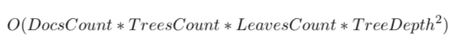

# [SHAP](https://arxiv.org/abs/1705.07874) values comparison

**Introduction**

In this benchmark we evaluated the shap values calculation performance for different gradient boosting libraries. The original paper about shap values you could find [here](https://arxiv.org/abs/1802.03888) and the official implementation [here](https://github.com/slundberg/shap).
	
Let us briefly overview the asymptotic analysis for different libraries.
	
Catboost:
	

where the AverageFeatureCount is an average number of features over all trees which could be found in a tree.

XGBoost and LightGBM:

As we're interested on the large scale datasets the most important values there are TreesCount and DocsCount. The factor of TreesCount * DocsCount in Catboost (TreeDepth + AverageFeaturesCount) is much smaller than in other libraries (LeavesCount * TreeDepth^2) such as XGBoost and LightGBM. So the larger the dataset is, the larger performance gain is achieved with Catboost.

For small datasets (when LeavesCount > DocsCount, usecase: we're trying to find SHAP values for a particular document) we use a direct algorithm like in XGBoost. One can specify this behavior using shap_mode option in get_feature_importance.

**Experiment infrastructure**: 

* GPU: Titan X Pascal (used only for training)
* Intel(R) Xeon(R) CPU E5-2683 v3 @ 2.00GHz 
	
We trained models on GPU but all evaluations were done on CPU.

**Parameters**

We run experiments on different depths and test sizes for each 	library. ``max bin`` parameter was set up to 128 and 	other parameters were default for every library.
	
**Dataset**

We used [Epsilon dataset](https://www.csie.ntu.edu.tw/~cjlin/libsvmtools/datasets/binary.html) (400К samples | 2000 features) to benchmark our performance.
	
		
**Results**

Time in the table is given in seconds and we didn't take into account time for data preprocessing.

depth|test size|catboost|lightgbm|xgboost|
:--------|:----|:-------|:-------|:------|
2|1000|0.311|**0.090**|0.112|
2|5000|1.171|0.284|**0.241**
2|10000|2.048|0.621|**0.509**
4|1000|**0.281**|0.578|0.300
4|5000|1.081|2.094|**0.931**
4|10000|2.263|4.291|**1.935**
6|1000|**0.464**|4.159|1.468
6|5000|**1.319**|20.624|6.498
6|10000|**2.396**|42.788|12.981
8|1000|**4.918**|23.844|7.847
8|5000|**5.807**|118.552|38.992
8|10000|**7.078**|240.614|77.883
10|1000|93.152|119.527|**30.872**
10|5000|**95.049**|601.251|153.408
10|10000|**95.680**|1189.685|306.529

Also we compared time for data preprocessing for every test size (average time is given in seconds for 5 runs).

|test size| catboost | lightgbm | xgboost |
:---------|:---------|:---------|:--------|
1000      | 0.069    | 0.002    | 0.011   |
5000      | 0.349    | 0.001    | 0.047   |
10000     | 0.770    | 0.001    | 0.089   |

