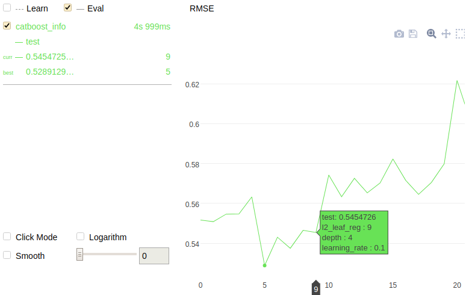

```python
from catboost import CatBoost
import numpy as np

train_data = np.random.randint(1, 100, size=(100, 10))
train_labels = np.random.randint(2, size=(100))

model = CatBoost()

grid = {'learning_rate': [0.03, 0.1],
        'depth': [4, 6, 10],
        'l2_leaf_reg': [1, 3, 5, 7, 9]}

grid_search_result = model.grid_search(grid,
                                       X=train_data,
                                       y=train_labels,
                                       plot=True)

```



