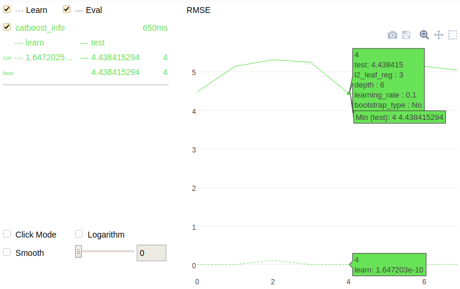

```python
from catboost import CatBoost

train_data = [[1, 4, 5, 6],
              [4, 5, 6, 7],
              [30, 40, 50, 60],
              [20, 30, 70, 60],
              [10, 80, 40, 30],
              [10, 10, 20, 30]]
train_labels = [10, 20, 30, 15, 10, 25]
model = CatBoost()

grid = {'learning_rate': [0.03, 0.1],
        'depth': [4, 6, 10],
        'l2_leaf_reg': [1, 3, 5, 7, 9]}

randomized_search_result = model.randomized_search(grid,
                                                   X=train_data,
                                                   y=train_labels,
                                                   plot=True)

```



