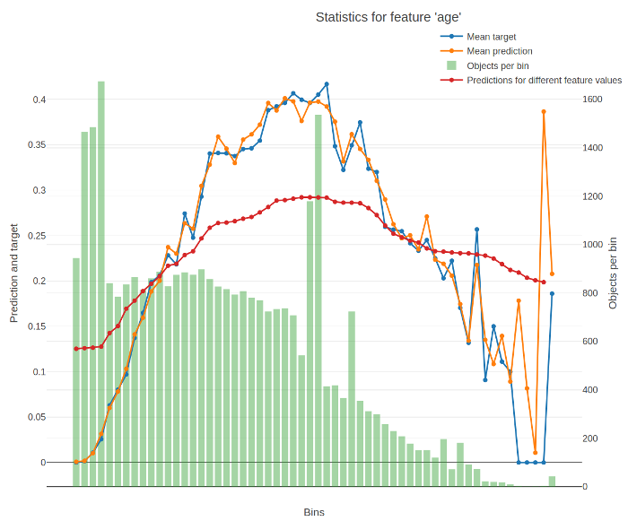

An example of plotted statistics:

The X-axis of the resulting chart contains values of the feature divided into buckets. For numerical features, the splits between buckets represent conditions (`feature < value`) from the trees of the model. For categorical features, each bucket stands for a category.

The Y-axis of the resulting chart contains the following graphs:

- 
    
- 
    
- 
    
- 

The return value of the function contains the data from these graps.

The following information is used for calculation:

- Trained model
- Dataset
- Label values
