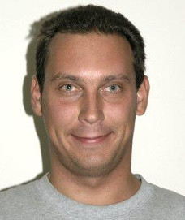
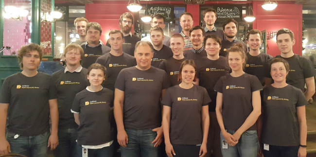
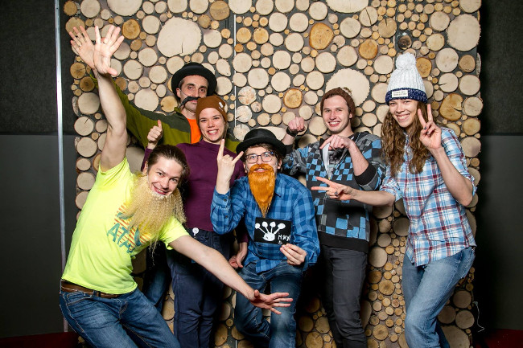
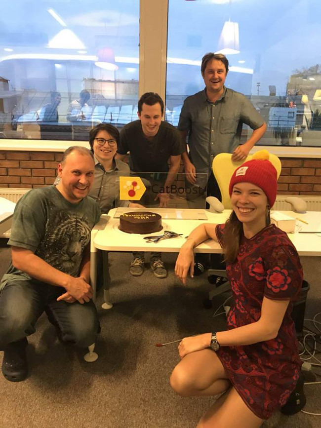
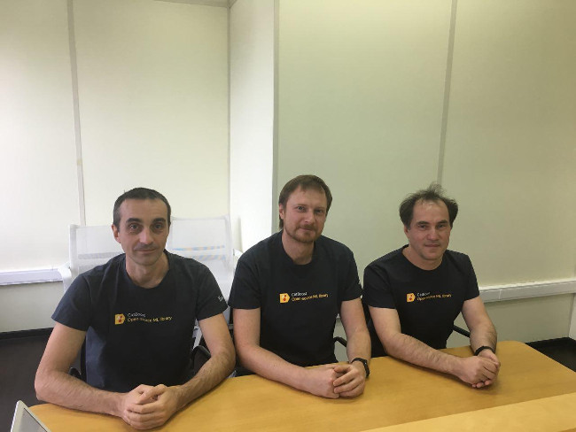
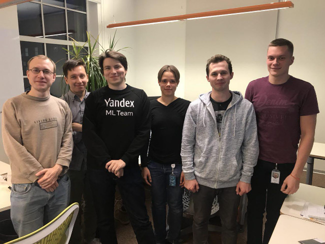

# Contacts









#### Support

- Ask questions on Stack overflow with the [catboost tag](https://stackoverflow.com/questions/tagged/catboost). These questions are monitored by the development team.
- Join our [English](https://t.me/catboost_en) and [Russian](https://t.me/catboost_ru) Telegram groups.
- Join our Slack community where we have our channel: `#tool_catboost` in [http://opendatascience.slack.com](https://opendatascience.slack.com/).





#### Bug reporting

Use the [catboost/issues](https://github.com/catboost/catboost/issues) page on GitHub for bug reports.



#### General Constructor

 Andrey Gulin 

  

#### The {{ product }} team

