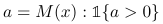

# Ranking: objectives and metrics

## Pairwise metrics {#pairwise-metrics}

Pairwise metrics use special labeled information — pairs of dataset objects where one object is considered the <q>winner</q> and the other is considered the <q>loser</q>. This information might be not exhaustive (not all possible pairs of objects are labeled in such a way). It is also possible to specify the weight for each pair.

If GroupId is specified, then all pairs must have both members from the same group if this dataset is used in pairwise modes.



The identifier of the object's group. An arbitrary string, possibly representing an integer.



If the labeled pairs data is not specified for the dataset, then pairs are generated automatically in each group using per-object label values (labels must be specified and must be numerical). The object with a greater label value in the pair is considered the <q>winner</q>.

### Specific variables used {#specific-variables-used}

The following variables are used in formulas of the described pairwise metrics:
- $p$ is the positive object in the pair.
- $n$ is the negative object in the pair.

### Objectives and metrics {#pairwise-objectives-and-metrics}

### {{ error-function__PairLogit }} {#PairLogit}

{{ title__loss-functions__calculation-principles }}

$\displaystyle\frac{-\sum\limits_{p, n \in Pairs} w_{pn} \left(log(\displaystyle\frac{1}{1 + e^{- (a_{p} - a_{n})}})\right)}{\sum\limits_{p, n \in Pairs} w_{pn}}$





{{ title__loss-functions__text__user-defined-params }}:



_Default:_ {{ loss-functions__use_weights__default }}



The maximum number of generated pairs in each group. Takes effect if no pairs are given and therefore are generated without repetition.



_Default:_ {{ loss-functions__params__max_pairs_default }}


### {{ error-function__PairLogitPairwise }} {#PairLogitPairwise}

{{ title__loss-functions__calculation-principles }}

$\displaystyle\frac{-\sum\limits_{p, n \in Pairs} w_{pn} \left(log(\displaystyle\frac{1}{1 + e^{- (a_{p} - a_{n})}})\right)}{\sum\limits_{p, n \in Pairs} w_{pn}}$


This metric may give more accurate results on large datasets compared to {{ error-function__PairLogit }} but it is calculated significantly slower.

This technique is described in the [Winning The Transfer Learning Track of Yahoo!’s Learning To Rank Challenge with YetiRank](http://proceedings.mlr.press/v14/gulin11a.html) paper.




{{ title__loss-functions__text__user-defined-params }}:



_Default:_ {{ loss-functions__use_weights__default }}




The maximum number of generated pairs in each group. Takes effect if no pairs are given and therefore are generated without repetition.

_Default:_  {{ loss-functions__params__max_pairs_default }}




### {{ error-function__PairAccuracy }} {#PairAccuracy}

{{ title__loss-functions__calculation-principles }}

$\displaystyle\frac{\sum\limits_{p, n \in Pairs} w_{pn} [a_{p} > a_{n}] }{\sum\limits_{p, n \in Pairs} w_{pn} }$






{{ title__loss-functions__text__user-defined-params }}:



_Default:_ {{ loss-functions__use_weights__default }}


### {{ title__loss-functions__text__optimization }}

| Name                                                        | Optimization            |
--------------------------------------------------------------|-------------------------|
[{{ error-function__PairLogit }}](#PairLogit)                 |     +                   |
[{{ error-function__PairLogitPairwise }}](#PairLogitPairwise) |     +                   |
[{{ error-function__PairAccuracy }}](#PairAccuracy)           |     -                   |


## Groupwise metrics {#groupwise-metrics}

### {{ error-function__YetiRank }} {#YetiRank}

The calculation of this metric is disabled by default for the training dataset to speed up the training. Use the `hints=skip_train~false` parameter to enable the calculation.







This metric gives less accurate results on big datasets compared to {{ error-function__YetiRankPairwise }} but it is significantly faster.




{{ title__loss-functions__text__user-defined-params }}:


- {{ loss-functions__params__decay }}

    The probability of search continuation after reaching the current object.


    {{ ph__loss-functions__default }}{{ fit__decay__yetirank }}

- {{ loss-functions__params__permutations }}

    The number of permutations.


    {{ fit__permutations }}

- {{ loss-functions__params__use_weights }}

    Use object/group weights to calculate metrics if the specified value is <q>true</q> and set all weights to <q>1</q> regardless of the input data if the specified value is <q>false</q>.


    true


### {{ error-function__YetiRankPairwise }} {#YetiRankPairwise}


The calculation of this metric is disabled by default for the training dataset to speed up the training. Use the `hints=skip_train~false` parameter to enable the calculation.







This metric gives more accurate results on big datasets compared to {{ error-function__YetiRank }} but it is significantly slower.

This technique is described in the [Winning The Transfer Learning Track of Yahoo!’s Learning To Rank Challenge with YetiRank](http://proceedings.mlr.press/v14/gulin11a.html) paper.




{{ title__loss-functions__text__user-defined-params }}:

- The probability of search continuation after reaching the current object.

    The probability of search continuation after reaching the current object.


    {{ ph__loss-functions__default }}{{ fit__decay__yetirank }}

-  The number of permutations.


    The number of permutations.


    {{ fit__permutations }}

-  Use object/group weights to calculate metrics if the specified value is <q>true</q> and set all weights to <q>1</q> regardless of the input data if the specified value is <q>false</q>.

    Use object/group weights to calculate metrics if the specified value is <q>true</q> and set all weights to <q>1</q> regardless of the input data if the specified value is <q>false</q>.


    true


### {{ error-function__StochasticFilter }} {#StochasticFilter}

Directly optimize the {{ error-function__FilteredDCG }} metric calculated for a pre-defined order of objects for filtration of objects under a fixed ranking. As a result, the {{ error-function__FilteredDCG }} metric can be used for optimization.

$FilteredDCG = \sum\limits_{i=1}^{n}\displaystyle\frac{t_{i}}{i} { , where}$

$t_{i}$ is the relevance of an object in the group and the sum is computed over the documents with $a > 0$.

The filtration is defined via the raw formula value:



Zeros correspond to filtered instances and ones correspond to the remaining ones.

The ranking is defined by the order of objects in the dataset.


Sort objects by the column you are interested in before training with this loss function and use the `--has-time`for the Command-line version option to avoid further objects reordering.



For optimization, a distribution of filtrations is defined:

$\mathbb{P}(\text{filter}|x) = \sigma(a) { , where}$
- $\sigma(z) = \displaystyle\frac{1}{1 + \text{e}^{-z}}$
- The gradient is estimated via REINFORCE.

Refer to the [Learning to Select for a Predefined Ranking]({{ learning-to-select-for-predefined-ranking }}) paper for calculation details.


{{ title__loss-functions__text__user-defined-params }}:

- {{ loss-functions__params__sigma }}

    The scale for multiplying predictions.


    1

- {{ loss-functions__params__num_estimations }}

    The number of gradient samples.


    1


### {{ error-function__StochasticRank }} {#StochasticRank}

Directly optimize the selected metric. The value of the selected metric is written to [output data](../concepts/output-data.md)

Refer to the [StochasticRank: Global Optimization of Scale-Free Discrete Functions](https://arxiv.org/abs/2003.02122v1) paper for details.


{{ title__loss-functions__text__user-defined-params }}:


Common parameters:

- {{ loss-functions__params__metric }}

    The metric that should be optimized.

    Supported values:
    - {{ error-function__dcg }}
    - {{ error-function__ndcg }}
    - {{ error-function__PFound }}


    {{ loss-functions__params__q__default }}

- {{ loss-functions__params__num_estimations }}

    The number of gradient estimation iterations.


    1

- {{ loss-functions__params__mu }}

    Controls the penalty for coinciding predictions (aka _ties_).


    0


Metric-specific parameters (available if the corresponding metric is set in the {{ loss-functions__params__metric }} parameter):

#### {{ error-function__dcg }}

- {{ loss-functions__params__top }}

    The number of top samples in a group that are used to calculate the ranking metric. Top samples are either the samples with the largest approx values or the ones with the lowest target values if approx values are the same.


    {{ loss-functions__params__top__default }}

- {{ loss-functions__params__type }}

    Metric calculation principles.<br/><br/>Possible values:<br/>- {{ error-function__ndcg__type__Base }}<br/>- {{ error-function__ndcg__type__Exp }}


    {{ error-function__dcg__type__default }}

- {{ loss-functions__params__denominator }}

    Metric denominator type.<br/><br/>Possible values:<br/>- {{ error-function__ndcg__denominator__LogPosition }}<br/>- {{ error-function__ndcg__denominator__Position }}


    {{ error-function__dcg__denominator__default }}


#### {{ error-function__ndcg }}

- {{ loss-functions__params__top }}

    The number of top samples in a group that are used to calculate the ranking metric. Top samples are either the samples with the largest approx values or the ones with the lowest target values if approx values are the same.


    {{ loss-functions__params__top__default }}

- {{ loss-functions__params__type }}

    Metric calculation principles.<br/><br/>Possible values:<br/>- {{ error-function__ndcg__type__Base }}<br/>- {{ error-function__ndcg__type__Exp }}


    {{ error-function__ndcg__type__default }}

- {{ loss-functions__params__denominator }}

    Metric denominator type.<br/><br/>Possible values:<br/>- {{ error-function__ndcg__denominator__LogPosition }}<br/>- {{ error-function__ndcg__denominator__Position }}


    {{ error-function__ndcg__denominator__default }}


#### {{ error-function__PFound }}

- {{ loss-functions__params__decay }}

    The probability of search continuation after reaching the current object.


    {{ ph__loss-functions__default }}{{ fit__decay__pfound }}

- {{ loss-functions__params__top }}

    The number of top samples in a group that are used to calculate the ranking metric. Top samples are either the samples with the largest approx values or the ones with the lowest target values if approx values are the same.


    {{ loss-functions__params__top__default }}


### {{ error-function__QueryCrossEntropy }} {#QueryCrossEntropy}

{{ title__loss-functions__calculation-principles }}

$QueryCrossEntropy(\alpha) = (1 - \alpha) \cdot LogLoss + \alpha \cdot LogLoss_{group}$

See the [{{ error-function__QueryCrossEntropy }}](../references/querycrossentropy.md) section for more details.


{{ title__loss-functions__text__user-defined-params }}:

- {{ loss-functions__params__use_weights }}

    Use object/group weights to calculate metrics if the specified value is <q>true</q> and set all weights to <q>1</q> regardless of the input data if the specified value is <q>false</q>.


    {{ loss-functions__use_weights__default }}

- {{ loss-functions__params__alpha }}

    The coefficient used in quantile-based losses.


    0.95


### {{ error-function__QueryRMSE }} {#QueryRMSE}

{{ title__loss-functions__calculation-principles }}

$\displaystyle\sqrt{\displaystyle\frac{\sum\limits_{Group \in Groups} \sum\limits_{i \in Group} w_{i} \left( t_{i} - a_{i} - \displaystyle\frac{\sum\limits_{j \in Group} w_{j} (t_{j} - a_{j})}{\sum\limits_{j \in Group} w_{j}} \right)^{2}} {\sum\limits_{Group \in Groups} \sum\limits_{i \in Group} w_{i}}}$


{{ title__loss-functions__text__user-defined-params }}:



_Default:_ {{ loss-functions__use_weights__default }}


### {{ error-function__QuerySoftMax }} {#QuerySoftMax}

{{ title__loss-functions__calculation-principles }}

$- \displaystyle\frac{\sum\limits_{Group \in Groups} \sum\limits_{i \in Group}w_{i} t_{i} \log \left(\displaystyle\frac{w_{i} e^{\beta a_{i}}}{\sum\limits_{j\in Group} w_{j} e^{\beta a_{j}}}\right)} {\sum\limits_{Group \in Groups} \sum_{i\in Group} w_{i} t_{i}}$


{{ title__loss-functions__text__user-defined-params }}:



_Default:_ {{ loss-functions__use_weights__default }}


- {{ loss-functions__params__beta }}

    The input scale coefficient.


    1


### {{ error-function__PFound }} {#PFound}

The calculation of this metric is disabled by default for the training dataset to speed up the training. Use the `hints=skip_train~false` parameter to enable the calculation.

{{ title__loss-functions__calculation-principles }}

$PFound(top, decay) =$

$= \sum_{group \in groups} PFound(group, top, decay)$

See the [{{ error-function__PFound }}](../references/pfound.md) section for more details


{{ title__loss-functions__text__user-defined-params }}:

- The probability of search continuation after reaching the current object.

    The probability of search continuation after reaching the current object.


    {{ ph__loss-functions__default }}{{ fit__decay__pfound }}

- The number of top samples in a group that are used to calculate the ranking metric. Top samples are either the samples with the largest approx values or the ones with the lowest target values if approx values are the same.

    The number of top samples in a group that are used to calculate the ranking metric. Top samples are either the samples with the largest approx values or the ones with the lowest target values if approx values are the same.


    {{ loss-functions__params__top__default }}


- {{ loss-functions__params__use_weights }}

    Use object/group weights to calculate metrics if the specified value is <q>true</q> and set all weights to <q>1</q> regardless of the input data if the specified value is <q>false</q>.


    {{ loss-functions__use_weights__default }}


### {{ error-function__ndcg }} {#ndcg}

The calculation of this metric is disabled by default for the training dataset to speed up the training. Use the `hints=skip_train~false` parameter to enable the calculation.

{{ title__loss-functions__calculation-principles }}

$nDCG(top) = \frac{DCG(top)}{IDCG(top)}$

See the [{{ error-function__ndcg }}](../references/ndcg.md) section for more details.


{{ title__loss-functions__text__user-defined-params }}:

- The number of top samples in a group that are used to calculate the ranking metric. Top samples are either the samples with the largest approx values or the ones with the lowest target values if approx values are the same.

    The number of top samples in a group that are used to calculate the ranking metric. Top samples are either the samples with the largest approx values or the ones with the lowest target values if approx values are the same.


    {{ loss-functions__params__top__default }}

- Metric calculation principles.<br/><br/>Possible values:<br/>- {{ error-function__ndcg__type__Base }}<br/>- {{ error-function__ndcg__type__Exp }}

    Metric calculation principles.<br/><br/>Possible values:<br/>- {{ error-function__ndcg__type__Base }}<br/>- {{ error-function__ndcg__type__Exp }}


    {{ error-function__ndcg__type__default }}

- Metric denominator type.<br/><br/>Possible values:<br/>- {{ error-function__ndcg__denominator__LogPosition }}<br/>- {{ error-function__ndcg__denominator__Position }}

    Metric denominator type.<br/><br/>Possible values:<br/>- {{ error-function__ndcg__denominator__LogPosition }}<br/>- {{ error-function__ndcg__denominator__Position }}


    {{ error-function__ndcg__denominator__default }}


- {{ loss-functions__params__use_weights }}

    Use object/group weights to calculate metrics if the specified value is <q>true</q> and set all weights to <q>1</q> regardless of the input data if the specified value is <q>false</q>.


    {{ loss-functions__use_weights__default }}


### {{ error-function__dcg }} {#dcg}


The calculation of this metric is disabled by default for the training dataset to speed up the training. Use the `hints=skip_train~false` parameter to enable the calculation.

{{ title__loss-functions__calculation-principles }}

$DCG(top)$

See the [{{ error-function__ndcg }}](../references/ndcg.md) section for more details.


{{ title__loss-functions__text__user-defined-params }}:

- The number of top samples in a group that are used to calculate the ranking metric. Top samples are either the samples with the largest approx values or the ones with the lowest target values if approx values are the same.

    The number of top samples in a group that are used to calculate the ranking metric. Top samples are either the samples with the largest approx values or the ones with the lowest target values if approx values are the same.


    {{ loss-functions__params__top__default }}

- Metric calculation principles.<br/><br/>Possible values:<br/>- {{ error-function__ndcg__type__Base }}<br/>- {{ error-function__ndcg__type__Exp }}

    Metric calculation principles.<br/><br/>Possible values:<br/>- {{ error-function__ndcg__type__Base }}<br/>- {{ error-function__ndcg__type__Exp }}


    {{ error-function__dcg__type__default }}

- Metric denominator type.<br/><br/>Possible values:<br/>- {{ error-function__ndcg__denominator__LogPosition }}<br/>- {{ error-function__ndcg__denominator__Position }}

    Metric denominator type.<br/><br/>Possible values:<br/>- {{ error-function__ndcg__denominator__LogPosition }}<br/>- {{ error-function__ndcg__denominator__Position }}


    {{ error-function__dcg__denominator__default }}


- {{ loss-functions__params__use_weights }}

    Use object/group weights to calculate metrics if the specified value is <q>true</q> and set all weights to <q>1</q> regardless of the input data if the specified value is <q>false</q>.


    {{ loss-functions__use_weights__default }}


### {{ error-function__FilteredDCG }} {#FilteredDCG}

The calculation of this metric is disabled by default for the training dataset to speed up the training. Use the `hints=skip_train~false` parameter to enable the calculation.


{{ title__loss-functions__calculation-principles }}

See the [{{ error-function__FilteredDCG }}](../references/filtereddcg.md) section for more details.


{{ title__loss-functions__text__user-defined-params }}:

- {{ loss-functions__params__type }}

    Metric calculation principles.<br/><br/>Possible values:<br/>- {{ error-function__ndcg__type__Base }}<br/>- {{ error-function__ndcg__type__Exp }}

    {{ error-function__filtereddcg__type__default }}

- {{ loss-functions__params__denominator }}" %}

    Metric denominator type.<br/><br/>Possible values:<br/>- {{ error-function__ndcg__denominator__LogPosition }}<br/>- {{ error-function__ndcg__denominator__Position }}


    {{ error-function__filtereddcg__denominator__default }}


### {{ error-function__QueryAverage }} {#QueryAverage}

Represents the average value of the label values for objects with the defined top $M$ label values.

See the [{{ error-function__QueryAverage }}](../references/queryaverage.md) section for more details.


{{ title__loss-functions__text__user-defined-params }}:

- {{ loss-functions__params__top }}

    The number of top samples in a group that are used to calculate the ranking metric. Top samples are either the samples with the largest approx values or the ones with the lowest target values if approx values are the same.


    {{ loss-functions__obligatory-text }}

- {{ loss-functions__params__use_weights }}

    Use object/group weights to calculate metrics if the specified value is <q>true</q> and set all weights to <q>1</q> regardless of the input data if the specified value is <q>false</q>.


    {{ loss-functions__use_weights__default }}


### {{ error-function__PrecisionAtK }} {#PrecisionAtK}

{{ title__loss-functions__calculation-principles }}




1. The objectsare sorted in descending order of predicted relevancies ($a_{i}$)

1. The metric is calculated as follows:

    $PrecisionAt(top, border) = \frac{\sum\limits_{i=1}^{top} Relevant_{i}}{top} { , where}$
    - $Relevant_{i} = \begin{cases} 1 { , } & t_{i} > {border} \\ 0 { , } & {in other cases} \end{cases}$


{{ title__loss-functions__text__user-defined-params }}:

- {{ loss-functions__params__top }}

    The number of top samples in a group that are used to calculate the ranking metric. Top samples are either the samples with the largest approx values or the ones with the lowest target values if approx values are the same.

    {{ loss-functions__params__top__default }}

- {{ loss-functions__params__border }}

    The label value border. If the value is strictly greater than this threshold, it is considered a positive class. Otherwise it is considered a negative class.


    {{ fit--border }}


### {{ error-function__RecallAtK }} {#RecallAtK}

{{ title__loss-functions__calculation-principles }}




1. The objectsare sorted in descending order of predicted relevancies ($a_{i}$)

1. The metric is calculated as follows:
    $RecalAt(top, border) = \frac{\sum\limits_{i=1}^{top} Relevant_{i}}{\sum\limits_{i=1}^{N} Relevant_{i}}$
    - $Relevant_{i} = \begin{cases} 1 { , } & t_{i} > {border} \\ 0 { , } & {in other cases} \end{cases}$


{{ title__loss-functions__text__user-defined-params }}:

- {{ loss-functions__params__top }}

    The number of top samples in a group that are used to calculate the ranking metric. Top samples are either the samples with the largest approx values or the ones with the lowest target values if approx values are the same.


    {{ loss-functions__params__top__default }}

- {{ loss-functions__params__border }}

    The label value border. If the value is strictly greater than this threshold, it is considered a positive class. Otherwise it is considered a negative class.


    {{ fit--border }}


### {{ error-function__mapk }} {#mapk}

{{ title__loss-functions__calculation-principles }}

1. The objectsare sorted in descending order of predicted relevancies ($a_{i}$)

1. The metric is calculated as follows:
    $MAP(top, border) = \frac{1}{N_{groups}} \sum\limits_{j = 1}^{N_{groups}} AveragePrecisionAt_{j}(top, border) { , where}$
    - $N_{groups}$ is the number of groups
    - $AveragePrecisionAt(top, border) = \frac{\sum\limits_{i=1}^{top} Relevant_{i} * PrecisionAt_{i}}{\sum\limits_{i=1}^{top} Relevant_{i} }$

    The value is calculated individually for each _j_-th group.

    - $Relevant_{i} = \begin{cases} 1 { , } & t_{i} > {border} \\ 0 { , } & {in other cases} \end{cases}$
    - $PrecisionAt_{i} = \frac{\sum\limits_{j=1}^{i} Relevant_{j}}{i}$


{{ title__loss-functions__text__user-defined-params }}:


- {{ loss-functions__params__top }}

    The number of top samples in a group that are used to calculate the ranking metric. Top samples are either the samples with the largest approx values or the ones with the lowest target values if approx values are the same.


    {{ loss-functions__params__top__default }}

- {{ loss-functions__params__border }}

    The label value border. If the value is strictly greater than this threshold, it is considered a positive class. Otherwise it is considered a negative class.


    {{ fit--border }}


### {{ error-function__err }} {#err}

{{ title__loss-functions__calculation-principles }}

$ERR = \frac{1}{|Q|} \sum_{q=1}^{|Q|} ERR_q$

$ERR_q = \sum_{i=1}^{top} \frac{1}{i} t_{q,i} \prod_{j=1}^{i-1} (1 - t_{q,j})$

Targets should be from the range [0, 1].

$t_{q,i} \in [0, 1]$


{{ title__loss-functions__text__user-defined-params }}:

- {{ loss-functions__params__top }}

    The number of top samples in a group that are used to calculate the ranking metric. Top samples are either the samples with the largest approx values or the ones with the lowest target values if approx values are the same.


    {{ loss-functions__params__top__default }}


## AUC {#auc}

### {{ error-function--AUC }} {#AUC}

The calculation of this metric is disabled by default for the training dataset to speed up the training. Use the `hints=skip_train~false` parameter to enable the calculation.





{{ title__loss-functions__text__user-defined-params }}:

- {{ loss-functions__params__use_weights }}

    Use object/group weights to calculate metrics if the specified value is <q>true</q> and set all weights to <q>1</q> regardless of the input data if the specified value is <q>false</q>.


    false

- {{ loss-functions__params__type }}

    

    Possible values:

    - {{ loss-functions__params__auc__type__Classic }}
    - {{ loss-functions__params__auc__type__Ranking }}

    Examples:
    ```
    AUC:type=Classic
    ```
    ```
    AUC:type=Ranking
    ```


## {{ title__loss-functions__text__optimization }}

### {{ error-function__mrr }} {#mrr}

{{ title__loss-functions__calculation-principles }}

$MRR = \frac{1}{|Q|} \sum_{q=1}^{|Q|} \frac{1}{rank_q}$, where $rank_q$ refers to the rank position of the first relevant document for the _q_-th query.


{{ title__loss-functions__text__user-defined-params }}:

- {{ loss-functions__params__top }}

  The number of top samples in a group that are used to calculate the ranking metric. Top samples are either the samples with the largest approx values or the ones with the lowest target values if approx values are the same.


    {{ loss-functions__params__top__default }}

- {{ loss-functions__params__border }}

  The label value border. If the value is strictly greater than this threshold, it is considered a positive class. Otherwise it is considered a negative class.


{{ fit--border }}



### {{ title__loss-functions__text__optimization }}


| Name                                                        | Optimization            |
--------------------------------------------------------------|-------------------------|
[{{ error-function__YetiRank }}](#YetiRank)                   |     +                   |
[{{ error-function__YetiRankPairwise }}](#YetiRankPairwise)   |     +                   |
[{{ error-function__StochasticFilter }}](#StochasticFilter)   |     +                   |
[{{ error-function__StochasticRank }}](#StochasticRank)       |     +                   |
[{{ error-function__dcg }}](#dcg)                             |     +                   |
[{{ error-function__QueryCrossEntropy }}](#QueryCrossEntropy) |     +                   |
[{{ error-function__QueryRMSE }}](#QueryRMSE)                 |     +                   |
[{{ error-function__QuerySoftMax }}](#QuerySoftMax)           |     +                   |
[{{ error-function__PFound }}](#PFound)                       |     -                   |
[{{ error-function__ndcg }}](#ndcg)                           |     -                   |
[{{ error-function__dcg }}](#dcg)                             |     -                   |
[{{ error-function__FilteredDCG }}](#PFilteredDCG)            |     -                   |
[{{ error-function__QueryAverage }}](#QueryAverage)           |     -                   |
[{{ error-function__PrecisionAtK }}](#PrecisionAtK)           |     -                   |
[{{ error-function__RecallAtK }}](#RecallAtK)                 |     -                   |
[{{ error-function__mapk }}](#mapk)                           |     -                   |
[{{ error-function__err }}](#err)                             |     -                   |
[{{ error-function__mrr }}](#mrr)                             |     -                   |
[{{ error-function--AUC }}](#AUC)                             |     -                   |
[{{ error-function--QueryAUC }}](#QueryAUC)                        |     -                   |

