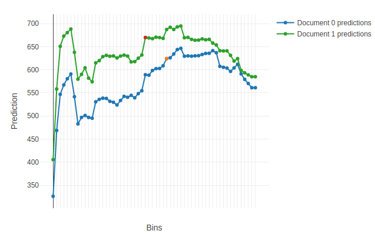

# plot_predictions



## {{ dl--parameters }} {#parameters}

### data

#### Description

The data to plot predictions for.

For example, use a two-document slice of the original dataset (refer to the example below).

**Possible types**

- numpy.ndarray
- pandas.DataFrame
- {{ python_type__pandas-SparseDataFrame }}
- scipy.sparse.spmatrix (all subclasses except dia_matrix)
- catboost.Pool

**Default value**

Required parameter

### features_to_change

#### Description

The list of numerical features to vary the prediction value for.

For example, chose the required features by selecting top N most important features that impact the prediction results for a pair of objects according to [PredictionDiff](fstr.md#fstr__prediction-diff) (refer to the example below).

**Possible types**

- list of int
- string
- combination of list of int & string

**Default value**

Required parameter

### plot

#### Description

Plot a Jupyter Notebook chart based on the calculated predictions.

**Possible types**

bool

**Default value**

True


### plot_file

#### Description

The name of the output HTML-file to save the chart to.

**Possible types**

string

**Default value**

None (the files is not saved)


## {{ dl__return-value }} {#output-format}

Dict with two fields:

A list of dictionaries with predictions for all objects in the data `float feature index -> [prediction for the object with corresponding feature values in the bucket : for all buckets used in the model]`

## {{ dl--example }} {#example}

```python
import numpy as np
from catboost import Pool, CatBoost

train_data = np.random.randint(0, 100, size=(100, 10))
train_label = np.random.randint(0, 1000, size=(100))
train_pool = Pool(train_data, train_label)
train_pool_slice = train_pool.slice([2, 3])

model = CatBoost()
model.fit(train_pool)

prediction_diff = model.get_feature_importance(train_pool_slice,
                                               type='PredictionDiff',
                                               prettified=True)

model.plot_predictions(data=train_pool_slice,
                       features_to_change=prediction_diff["Feature Id"][:2],
                       plot=True,
                       plot_file="plot_predictions_file.html")

```

An example of the first plotted chart:

