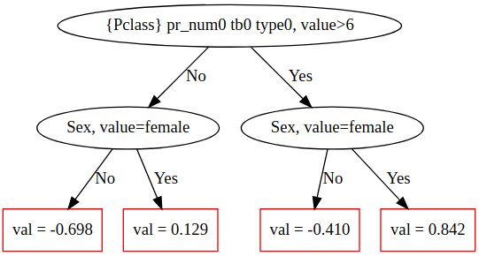

# plot_tree

Visualize the {{ product }} decision trees.

## {{ dl__dependencies }} {#dependencies}

[graphviz](https://graphviz.gitlab.io/download/)

## {{ dl--invoke-format }} {#method-call-format}

```python
plot_tree(tree_idx, pool=None)
```

## {{ dl--parameters }} {#parameters}

### tree_idx

#### Description

The index of the tree from the model that should be visualized.

**Possible types** 

{{ python-type--int }}

**Default value** 

{{ python--required }}

### pool

#### Description

An optional parameter for models that contain only float features. Allows to pass a pool and label features with their external indices from this pool. If the pool is not input, internal indices are used.

For example, for a semicolon-separated pool with 2 features <q>f1;label;f2</q> the external feature indices are 0 and 2, while the internal indices are 0 and 1 respectively.

**Possible types** 

{{ python-type--pool }}

**Default value** 

None

Required for models with one-hot encoded categorical feature


## {{ dl--output-format }} {#type-of-return-value}

A graphviz.dot.Digraph object describing the visualized tree.

Inner vertices of the tree correspond to splits, and specify factor names and borders used in splits.

Leaf vertices contain raw values predicted by the tree (RawFormulaVal, see [Model values](../concepts/output-data_model-value-output.md)).

For MultiClass models, leaves contain ClassCount values (with zero sum). Class of a leaf can be obtained as argMax of this array of values in the leaf.

For MultiRMSE models, leaves contain one value for each label.

## {{ dl__usage-examples }} {#example}

```
import numpy as np
import catboost
from catboost import CatBoost, Pool

from catboost.datasets import titanic
titanic_df = titanic()

X = titanic_df[0].drop('Survived',axis=1)
y = titanic_df[0].Survived

is_cat = (X.dtypes != float)
for feature, feat_is_cat in is_cat.to_dict().items():
    if feat_is_cat:
        X[feature].fillna("NAN", inplace=True)

cat_features_index = np.where(is_cat)[0]
pool = Pool(X, y, cat_features=cat_features_index, feature_names=list(X.columns))

model = CatBoost(
    max_depth=2, verbose=False, max_ctr_complexity=1, iterations=2).fit(pool)

model.plot_tree(
    tree_idx=0,
    pool=pool
)

```

An example of a plotted tree:

## Tutorial {#tutorial}

Refer to the [Visualization of CatBoost decision trees tutorial](https://github.com/catboost/tutorials/blob/master/model_analysis/visualize_decision_trees_tutorial.ipynb) for details.

