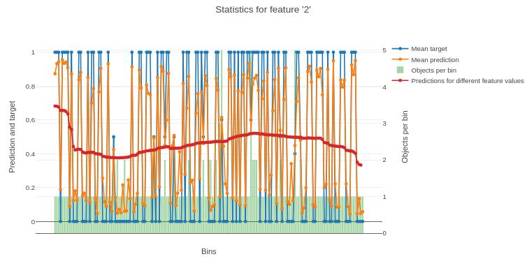

# calc_feature_statistics




## {{ dl--invoke-format }} {#get_feature_statistics__method_call_format}

```python
calc_feature_statistics(data,
                        target=None,
                        feature=None,
                        prediction_type=None,
                        cat_feature_values=None,
                        plot=True,
                        max_cat_features_on_plot=10,
                        thread_count=-1,
                        plot_file=None)
```

## {{ dl--parameters }} {#get_feature_statistics__parameters}

### data

#### Description

The data to calculate the statistics on.

**Possible types**

- {{ python-type--numpy-ndarray }}
- {{ python-type--pandasDataFrame }}
- {{ python_type__pandas-SparseDataFrame }}
- 

**Default value**

{{ python--required }}

### target

#### Description

Label values for objects from the input data.

**Possible types**

- {{ python-type--numpy-ndarray }}
- {{ python-type--pandasSeries }}

**Default value**

{{ python--required }}

### feature

#### Description

The feature index, name or a list of any their combination to calculate the statistics for.



Output information regarding a single feature indexed 0:
```python
feature=0
```

Output information regarding two features, one of which is named `age` and the second is indexed 10:

```python
feature=["age", 10]
```



**Possible types**

- {{ python-type--int }}
- {{ python-type--string }}
- {{ python-type--list }} of {{ python-type--int }}, {{ python-type--string }} or their combination

**Default value**

{{ python--required }}

### prediction_type

#### Description

The prediction type to calculate the mean prediction.

Possible values:
- {{ prediction-type--Probability }}
- {{ prediction-type--Class }}
- {{ prediction-type--RawFormulaVal }}
- {{ prediction-type--Exponent }}
- {{ prediction-type--LogProbability }}

**Possible types**

{{ python-type--string }}

**Default value**

None ({{ prediction-type--Probability }} for {{ error-function--Logit }} and {{ error-function--CrossEntropy }}, {{ prediction-type--RawFormulaVal }} for all other loss functions)

### cat_feature_values

#### Description

A list of categorical feature values to calculate the statistics on. Can be used if statistics are calculated for a categorical feature.

**Possible types**

- {{ python-type--list }}
- {{ python-type--numpy-ndarray }}
- {{ python-type--pandasSeries }}

**Default value**

None (statistics are calculated for all values of categorical feature)

### plot

#### Description

Plot a [Jupyter Notebook](../features/visualization_jupyter-notebook.md) chart based on the calculated statistics.

**Possible types**

{{ python-type--bool }}

**Default value**

{{ get_feature_statistics__plot__default }}

### max_cat_features_on_plot

#### Description

The maximum number of different values of a categorical feature to output on one chart.

If the selected categorical feature takes more different values than the value set in this parameter, several charts are plotted.

**Possible types**

{{ python-type--int }}

**Default value**

{{ get_feature_statistics__thread_count__default }}

### thread_count

#### Description

The number of threads to use for calculating statistics.

**Possible types**

{{ python-type--int }}

**Default value**

{{ fit__thread_count__wrappers }}

### plot_file

#### Description

The name of the output file to save the chart to.

**Possible types** {{ python-type--string }}

**Default value** None (the file is not saved)

## {{ dl__usage-examples }} {#usage-examples}

```python
from catboost import CatBoostClassifier
import numpy as np

train_data = np.random.rand(200, 10)
label_values = np.random.randint(0, 2, size=(200))

model = CatBoostClassifier()
model.fit(train_data, label_values)

res = model.calc_feature_statistics(train_data,
                                    label_values,
                                    feature=2,
                                    plot=True)

```




