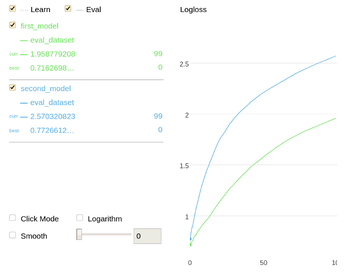

# compare




## {{ dl--invoke-format }} {#compare__method-call-format}

```python
compare(model,
        data=None,
        metrics=None,
        ntree_start=0,
        ntree_end=0,
        eval_period=1,
        thread_count=-1,
        tmp_dir=None,
        log_cout=sys.stdout,
        log_cerr=sys.stderr)
```

## {{ dl--parameters }} {#parameters}
**Parameter:** `model`

**Possible types:** {{ product }} Model

#### Description


The {{ product }} model to compare with.


**Default value**

 {{ python--required }}

**Parameter:** `metrics`{{ python-type--list-of-strings }}
The list of metrics to be calculated.
[Supported metrics](../references/custom-metric__supported-metrics.md)
For example, if the {{ error-function--AUC }} and {{ error-function--Logit }} metrics should be calculated, use the following construction:

```python
['Logloss', 'AUC']
```
{{ python--required }}

**Parameter:** `data`

**Possible types:** {{ python-type--pool }}

#### Description

 A file or matrix with the input dataset, on which the compared metric values should be calculated.

**Default value**

 {{ python--required }}

**Parameter:** `ntree_start`

**Possible types:** {{ python-type--int }}

#### Description


To reduce the number of trees to use when the model is applied or the metrics are calculated, setthe range of the tree indices to`[ntree_start; ntree_end)` and the `eval_period` parameter to _k_ to calculate metrics on every _k_-th iteration.




**Default value**

 {{ fit--ntree_start }}

**Parameter:** `ntree_end`

**Possible types:** {{ python-type--int }}

#### Description


To reduce the number of trees to use when the model is applied or the metrics are calculated, setthe range of the tree indices to`[ntree_start; ntree_end)` and the `eval_period` parameter to _k_ to calculate metrics on every _k_-th iteration.




**Default value**

 {{ fit--ntree_end }}

**Parameter:** `eval_period`

**Possible types:** {{ python-type--int }}

#### Description


To reduce the number of trees to use when the model is applied or the metrics are calculated, setthe range of the tree indices to`[ntree_start; ntree_end)` and the `eval_period` parameter to _k_ to calculate metrics on every _k_-th iteration.




In this case, the metrics are calculated for the following tree ranges: `[0, 2)`, `[0, 4)`, ... , `[0, N)`


**Default value**

 {{ fit--staged-predict-eval-period }}

**Parameter:** `thread_count`{{ python-type--int }}
The number of threads to use.



{{ fit__thread_count__wrappers }}

**Parameter:** `tmp_dir`

**Possible types:** {{ data-type__String }}

#### Description

 The name of the temporary directory for intermediate results.

**Default value**

 None (the name is generated)




## {{ dl--example }} {#examples}

```python
from catboost import Pool, CatBoostClassifier

train_data = [[0, 3],
              [4, 1],
              [8, 1],
              [9, 1]]
train_labels = [0, 0, 1, 1]

eval_data = [[1, 3],
             [4, 2],
             [8, 2],
             [8, 3]]

eval_labels = [1, 0, 0, 1]

train_dataset = Pool(train_data, train_labels)

eval_dataset = Pool(eval_data, eval_labels)

model1 = CatBoostClassifier(iterations=100, learning_rate=0.1)
model1.fit(train_dataset, verbose=False)

model2 = CatBoostClassifier(iterations=100, learning_rate=0.3)
model2.fit(train_dataset, verbose=False)

model1.compare(model2, eval_dataset, ['Logloss'])

```




