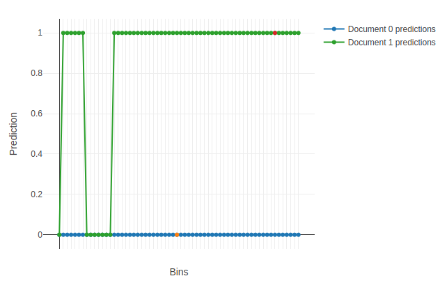

# plot_predictions



## {{ dl--parameters }} {#parameters}


### data

#### Description

The data to plot predictions for.

For example, use a two-document slice of the original dataset (refer to the example below).

**Possible types**

- {{ python-type--numpy-ndarray }}
- {{ python-type--pandasDataFrame }}
- {{ python_type__pandas-SparseDataFrame }}
- {{ python_type__scipy-sparse-spmatrix }}
- {{ python-type--pool }}

**Default value**

{{ python--required }}


### features_to_change

#### Description

To reduce the number of trees to use when the model is applied or the metrics are calculated, setthe The list of numerical features to vary the prediction value for.

For example, chose the required features by selecting top N most important features that impact the prediction results for a pair of objects according to [PredictionDiff](fstr.md#fstr__prediction-diff) (refer to the example below).

**Possible types**

- list of int
- string
- combination of list of int & string

**Default value**

{{ python--required }}


### plot

#### Description

Plot a Jupyter Notebook chart based on the calculated predictions.

**Possible types**

{{ python-type--bool }}

**Default value**

True


### plot_file

#### Description

The name of the output HTML-file to save the chart to.


**Possible types**

{{ python-type--string }}

**Default value**

None (the files is not saved)


## {{ dl__return-value }} {#output-format}

Dict with two fields:

- `params` — `dict` of best-found parameters.
- `cv_results` — `dict` or {{ python-type--pandascoreframeDataFrame }} with cross-validation results. Сolumns are: `test-error-mean`, `test-error-std`, `train-error-mean`, `train-error-std`.

## {{ dl--example }} {#example}

```python
import numpy as np
from catboost import Pool, CatBoostClassifier

train_data = np.random.randint(0, 100, size=(100, 10))
train_label = np.random.randint(0, 2, size=(100))
train_pool = Pool(train_data, train_label)
train_pool_slice = train_pool.slice([2, 3])

model = CatBoostClassifier()
model.fit(train_pool)

prediction_diff = model.get_feature_importance(train_pool_slice,
                                               type='PredictionDiff',
                                               prettified=True)

model.plot_predictions(data=train_pool_slice,
                       features_to_change=prediction_diff["Feature Id"][:2],
                       plot=True,
                       plot_file="plot_predictions_file.html")

```

An example of the first plotted chart:

