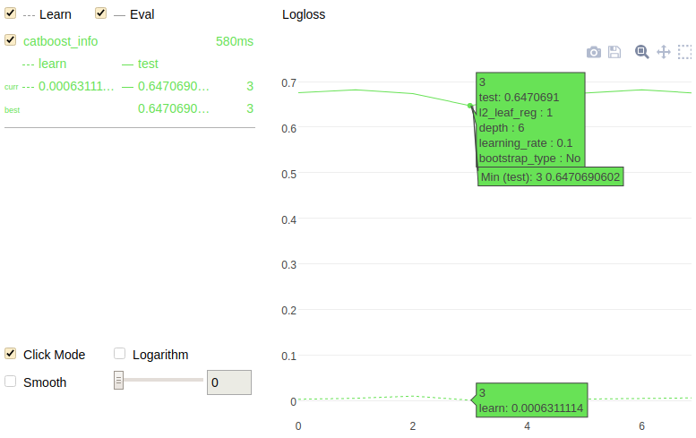

# randomized_search




## {{ dl--invoke-format }} {#method-call-format}

```python
randomized_search(param_distributions,
                  X,
                  y=None,
                  cv=3,
                  n_iter=10,
                  partition_random_seed=0,
                  calc_cv_statistics=True,
                  search_by_train_test_split=True,
                  refit=True,
                  shuffle=True,
                  stratified=None,
                  train_size=0.8,
                  verbose=True,
                  log_cout=sys.stdout,
                  log_cerr=sys.stderr)
```

## {{ dl--parameters }} {#parameters}
### param_distributions

#### Description


Dictionary with parameters names ({{ python-type--string }}) as keys and distributions or lists of parameter settings to try. Distributions must provide a `rvs` method for sampling (such as those from `scipy.stats.distributions`).

If a list is given, it is sampled uniformly.

**Possible types**

{{ python-type--dict }}

**Default value**

{{ python--required }}

### X

#### Description

The description is different for each of possible types.

**Possible types**



The input training dataset.



If a nontrivial value of the `cat_features` parameter is specified in the constructor of this class, {{ product }} checks the equivalence of categorical features indices specification from the constructor parameters and in this Pool class.







The input training dataset in the form of a two-dimensional feature matrix.









**Default value**

{{ python--required }}

### y

#### Description







Do not use this parameter if the input training dataset (specified in the `X` parameter) type is {{ python-type--pool }}.





### cv

#### Description


The cross-validation splitting strategy.

The interpretation of this parameter depends on the input data type:
- None — Use the default three-fold cross-validation.
- {{ python-type--int }} — The number of folds in a (Stratified)KFold
- 

- An iterable yielding train and test splits as arrays of indices.


**Possible types**


- {{ python-type--int }}
- scikit-learn splitter {{ python-type__object }}
- cross-validation generator
- iterable

**Default value**

None

### n_iter

#### Description

The number of parameter settings that are sampled. This parameter trades off runtime vs quality of the solution.


**Possible types**

{{ python-type--int }}

**Default value**

`0`

### partition_random_seed

#### Description










**Possible types**

{{ python-type--int }}

**Default value**

`0`

### search_by_train_test_split

#### Description


Split the source dataset into train and test parts. Models are trained on the train part, while parameters are compared by the loss function score on the test dataset.

It is recommended to enable this option for large datasets and disable it for the small ones.


**Possible types**

{{ python-type--bool }}

**Default value**

True

### calc_cv_statistics

#### Description


Estimate the quality by using cross-validation with the best of the found parameters. The model is fitted using these parameters.

This option can be enabled if the `search_by_train_test_split` parameter is set to True.

**Possible types**

{{ python-type--bool }}

**Default value**

True

### refit
#### Description

Refit an estimator using the best-found parameters on the whole dataset.

**Possible types**

{{ python-type--bool }}

**Default value**

`True`

### shuffle

#### Description

Shuffle the dataset objects before splitting into folds.

**Possible types**

{{ python-type--bool }}

**Default value**

`True`

### stratified

#### Description

Perform stratified sampling. True for classification and False otherwise.

**Possible types**

{{ python-type--bool }}

**Default value**

{{ python-type--none }}

### train_size

#### Description

The proportion of the dataset to include in the train split.

Possible values are in the range [0;1].

**Possible types**

{{ python-type--float }}

**Default value**

0.8

### verbose

#### Description





- {{ python-type--int }} — The frequency of iterations to print the information to stdout.
- {{ python-type--bool }} — Print the information to stdout on every iteration (if set to <q>True</q>) or disable any logging (if set to <q>False</q>).

**Possible types**


- {{ python-type--bool }}
- {{ python-type--int }}

**Default value**

True

### plot

#### Description

Draw train and evaluation metrics for every set of parameters in Jupyter [Jupyter Notebook](../features/visualization_jupyter-notebook.md).

**Possible types**

{{ python-type--bool }}

**Default value**

False



## {{ dl__return-value }} {#output-format}

Dict with two fields:

- `params` — `dict` of best-found parameters.
- `cv_results` — `dict` or {{ python-type--pandascoreframeDataFrame }} with cross-validation results. Сolumns are: `test-error-mean`, `test-error-std`, `train-error-mean`, `train-error-std`.

## {{ dl--example }} {#example}

```python
from catboost import CatBoostClassifier

train_data = [[0, 3],
              [4, 1],
              [8, 1],
              [9, 1],
              [8, 6],
              [9, 2]]
train_labels = [0, 0, 1, 1, 0, 1]
model = CatBoostClassifier(loss_function='Logloss')


grid = {'learning_rate': [0.03, 0.1],
        'depth': [4, 6, 10],
        'l2_leaf_reg': [1, 3, 5, 7, 9]}

randomized_search_result = model.randomized_search(grid,
                                                   X=train_data,
                                                   y=train_labels,
                                                   plot=True)
```




