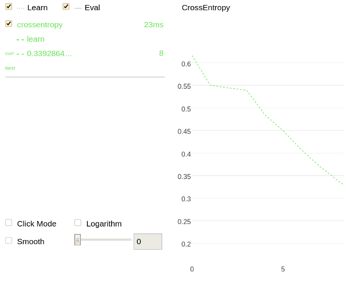
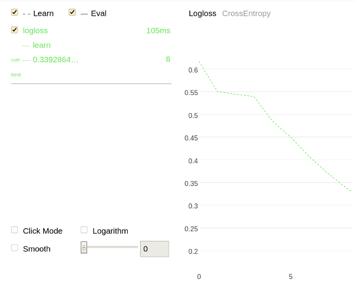

# MetricVisualizer

```python
class MetricVisualizer(train_dirs,
                       subdirs=False)
```

## {{ dl--purpose }} {#purpose}

Plot information regarding training, metric evaluations or cross-validation runs on a single chart. One chart can contain information regarding one or several runs depending on the input information. The charts can be either plotted in real time while the trainings are performed, or after the trainings are over.

## {{ dl--parameters }} {#parameters}
### train_dirs

#### Description

The directory or the list of directories to read the files generated during training.

**Possible types**

- {{ python-type--string }}
- {{ python-type--list-of-strings }}

**Default value**

{{ fit--train_dir }}

### subdirs

#### Description

Gather and read data from the specified directories and all subdirectories.

**Possible types**

{{ python-type--bool }}

**Default value**

{{ fit__python__ipythonwidgetsubdirs }}

## {{ dl--methods }} {#methods}

Method: [start](python-reference_catboostipythonwidget_update_widget.md)




> # Gather data from the specified directory only
>
> 1. Train a model from the root of the file system (`/`):
>     ```python
>     from catboost import CatBoostClassifier
>
>     cat_features = [0,1,2]
>
>     train_data = [["a", "b", 1, 4, 5, 6],
>     ["a", "b", 4, 5, 6, 7],
>     ["c", "d", 30, 40, 50, 60]]
>
>     train_labels = [1,1,0]
>
>     model = CatBoostClassifier(iterations=20,
>     loss_function = "CrossEntropy",
>     train_dir = "crossentropy")
>
>     model.fit(train_data, train_labels, cat_features)
>     predictions = model.predict(train_data)
>     ```
>
> 1. Plot a chart using the information regarding the previous training (from the `crossentropy` directory):
>     ```
>     import catboost
>
>     w = catboost.MetricVisualizer('/crossentropy/')
>     w.start()
>     ```
>
>     
>
>     

> # Gather and read data from all subdirectories
>
> 1. Train two models from the root of the file system (`/`):
>
>     ```python
>     from catboost import CatBoostClassifier
>
>     cat_features = [0,1,2]
>
>     train_data = [["a", "b", 1, 4, 5, 6],
>     ["a", "b", 4, 5, 6, 7],
>     ["c", "d", 30, 40, 50, 60]]
>
>     train_labels = [1,1,0]
>
>     model = CatBoostClassifier(iterations=20,
>     loss_function = "CrossEntropy",
>     train_dir = "crossentropy")
>
>     model.fit(train_data, train_labels, cat_features)
>     predictions = model.predict(train_data)
>     ```
>
>     ```python
>     from catboost import CatBoostClassifier
>
>     cat_features = [0,1,2]
>
>     train_data = [["a", "b", 1, 4, 5, 6],
>     ["a", "b", 4, 5, 6, 7],
>     ["c", "d", 30, 40, 50, 60]]
>
>     train_labels = [1,1,0]
>
>     model = CatBoostClassifier(iterations=20,
>     train_dir = "logloss")
>
>     model.fit(train_data, train_labels, cat_features)
>     predictions = model.predict(train_data)
>     ```
>
> 1. Plot charts using the information from all subdirectories (`crossentropy` and `logloss`) of the root of the file system:
>     ```python
>     import catboost
>
>     w = catboost.MetricVisualizer('/', subdirs=True)
>     w.start()
>     ```
>
>     
>
>     
