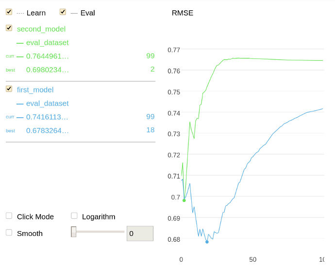

# compare




## {{ dl--invoke-format }} {#compare__method-call-format}

```python
compare(model,
        data=None,
        metrics=None,
        ntree_start=0,
        ntree_end=0,
        eval_period=1,
        thread_count=-1,
        tmp_dir=None)
```

## {{ dl--parameters }} {#parameters}

### model

#### Description

The {{ product }} model to compare with.

**Possible types**

{{ product }} Model

**Default value**

{{ python--required }}

### metrics

#### Description

The list of metrics to be calculated.
[Supported metrics](../references/custom-metric__supported-metrics.md)
For example, if the {{ error-function--AUC }} and {{ error-function--Logit }} metrics should be calculated, use the following construction:

```python
['Logloss', 'AUC']
```
**Possible types**

{{ python-type--list-of-strings }}

**Default value**

{{ python--required }}

### data

#### Description

A file or matrix with the input dataset, on which the compared metric values should be calculated.

**Possible types**

{{ python-type--pool }}

**Default value**

{{ python--required }}


### ntree_start

#### Description

To reduce the number of trees to use when the model is applied or the metrics are calculated, setthe range of the tree indices to`[ntree_start; ntree_end)` and the `eval_period` parameter to _k_ to calculate metrics on every _k_-th iteration.



**Possible types**

{{ python-type--int }}

**Default value**

{{ fit--ntree_start }}

### ntree_end

#### Description

To reduce the number of trees to use when the model is applied or the metrics are calculated, setthe range of the tree indices to`[ntree_start; ntree_end)` and the `eval_period` parameter to _k_ to calculate metrics on every _k_-th iteration.



**Possible types**

{{ python-type--int }}

**Default value**

{{ fit--ntree_end }}

### eval_period

#### Description

To reduce the number of trees to use when the model is applied or the metrics are calculated, setthe range of the tree indices to`[ntree_start; ntree_end)` and the `eval_period` parameter to _k_ to calculate metrics on every _k_-th iteration.




In this case, the metrics are calculated for the following tree ranges: `[0, 2)`, `[0, 4)`, ... , `[0, N)`

**Possible types**

{{ python-type--int }}

**Default value**

{{ fit--staged-predict-eval-period }}

### thread_count

#### Description

The number of threads to use.



**Possible types**

{{ python-type--int }}

**Default value**

{{ fit__thread_count__wrappers }}

### tmp_dir

#### Description

The name of the temporary directory for intermediate results.

**Possible types**

{{ data-type__String }}

**Default value**


None (the name is generated)


## {{ dl--example }} {#examples}

```python
from catboost import Pool, CatBoostRegressor

train_data = [[0, 3],
              [4, 1],
              [8, 1],
              [9, 1]]
train_labels = [0, 0, 1, 1]

eval_data = [[1, 3],
             [4, 2],
             [8, 2],
             [8, 3]]

eval_labels = [1, 0, 0, 1]

train_dataset = Pool(train_data, train_labels)

eval_dataset = Pool(eval_data, eval_labels)

model1 = CatBoostRegressor(iterations=100, learning_rate=0.1)
model1.fit(train_dataset, verbose=False)

model2 = CatBoostRegressor(iterations=100, learning_rate=0.3)
model2.fit(train_dataset, verbose=False)

model1.compare(model2, eval_dataset, ['RMSE'])

```




