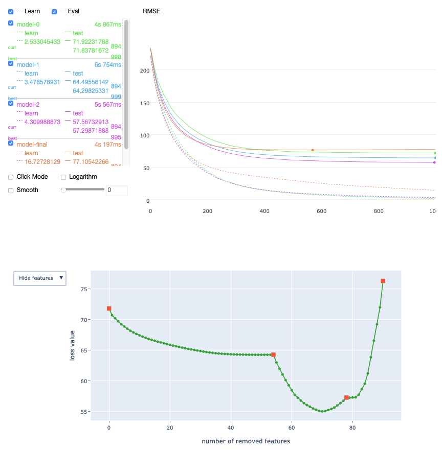

# select_features

## {{ dl--purpose }} {#purpose}




## {{ dl--invoke-format }} {#call-format}

```python
model.select_features(
                X,
                y=None,
                eval_set=None,
                features_for_select=None,
                num_features_to_select=None,
                algorithm=None,
                steps=None,
                shap_calc_type=None,
                train_final_model=False,
                verbose=None,
                logging_level=None,
                plot=False,
                log_cout=sys.stdout,
                log_cerr=sys.stderr)
```

## {{ dl--parameters }} {#parameters}

### X

#### Description

The input training dataset.



If a nontrivial value of the `cat_features` parameter is specified in the constructor of this class, {{ product }} checks the equivalence of categorical features indices specification from the constructor parameters and in this Pool class.



**Possible types**

{{ python-type--pool }}

**Default value**

{{ python--required }}

**Supported processing units**

{{ cpu-gpu }}

### y

#### Description







Do not use this parameter if the input training dataset (specified in the `X` parameter) type is {{ python-type--pool }}.





### eval_set

#### Description

The validation dataset or datasets used for the following processes:
- [overfitting detector](../concepts/overfitting-detector.md)
- best iteration selection
- monitoring metrics' changes

**Possible types**

- {{ python-type--pool }}
- {{ python-type--tuple }} (X, y)
- {{ python-type--string }} (path to the dataset file)

**Default value**

None

**Supported processing units**

{{ cpu-gpu }}


### features_for_select

#### Description

Features which participate in the selection. The following formats are supported:
- A list with indices, names, index ranges, name ranges. For example: `[0, 3, 5, 6, '10-15', 'City', 'Player1-Player11']`.
- A string with indices, names, index ranges, name ranges. Values are separated by commas, for example: `0,3,5,6,10-15,City,Player1-Player11`.

**Possible types**

- list
- string

**Default value**

{{ python--required }}

**Supported processing units**

{{ cpu-gpu }}


### num_features_to_select

#### Description

The number of features to select from `features_for_select`.

**Possible types**

int

**Default value**

{{ python--required }}

**Supported processing units**

{{ cpu-gpu }}


### steps

#### Description

The number of times for training the model. Use more steps for more accurate selection.

**Possible types**

int

**Default value**

1

**Supported processing units**

{{ cpu-gpu }}


### algorithm

#### Description

The main algorithm is [Recursive Feature Elimination](https://scikit-learn.org/stable/modules/generated/sklearn.feature_selection.RFE.html) with variable feature importance calculation method:

- `RecursiveByPredictionValuesChange` — the fastest algorithm and the least accurate method (not recommended for ranking losses).
- `RecursiveByLossFunctionChange` — the optimal option according to accuracy/speed balance.
- `RecursiveByShapValues` — the most accurate method.

**Possible types**

EFeaturesSelectionAlgorithm

**Default value**

RecursiveByShapValues

**Supported processing units**

{{ cpu-gpu }}


### shap_calc_type

#### Description

The method of the SHAP values calculations ordered by accuracy:

- `Approximate`
- `Regular`
- `Exact`

Used in RecursiveByLossFunctionChange and RecursiveByShapValues.

**Possible types**

EShapCalcType

**Default value**

Regular

**Supported processing units**

{{ cpu-gpu }}


### train_final_model

#### Description

If specified, then the model with selected features will be trained after features selection.

**Possible types**

bool

**Default value**

True

**Supported processing units**

{{ cpu-gpu }}


### verbose

_Alias:_`verbose_eval`

#### Description




- {{ python-type--bool }} — Defines the logging level:
    - <q>True</q>  corresponds to the Verbose logging level
    - <q>False</q> corresponds to the Silent logging level

- {{ python-type--int }} — Use the Verbose logging level and set the logging period to the value of this parameter.



Do not use this parameter with the `logging_level` parameter.



**Possible types**

- {{ python-type--bool }}
- {{ python-type--int }}

**Default value**

{{ train_verbose_fr-of-iterations-to-output__default }}

**Supported processing units** {{ cpu-gpu }}


### logging_level

#### Description

The logging level to output to stdout.

Possible values:
- Silent — Do not output any logging information to stdout.

- Verbose — Output the following data to stdout:

    - optimized metric
    - elapsed time of training
    - remaining time of training

- Info — Output additional information and the number of trees.

- Debug — Output debugging information.

**Possible types**

{{ python-type--string }}

**Default value**

None (corresponds to the {{ fit--verbose }} logging level)


**Supported processing units**

{{ cpu-gpu }}

### plot

#### Description

Plot the following information during training:
- the metric values;
- the custom loss values;
- the loss function change during feature selection;
- the time has passed since training started;
- the remaining time until the end of training.
This [option can be used](../features/visualization_jupyter-notebook.md) if training is performed in Jupyter notebook.

**Possible types**

{{ python-type--bool }}

**Default value**

{{ fit--plot }}

**Supported processing units**

{{ calcer_type__cpu }}



## {{ dl__return-value }} {#output-format}

Dict with four fields:
- `selected_features` — a list with indices of selected features.
- `selected_features_names` — a list with names of selected features, if feature names were specified.
- `eliminated_features` — a list with indices of eliminated features.
- `eliminated_features_names` — a list with names of eliminated features, if feature names were specified.

## Examples {#example}

```python
from catboost import CatBoostRegressor, Pool, EShapCalcType, EFeaturesSelectionAlgorithm
from sklearn.datasets import make_regression
from sklearn.model_selection import train_test_split

X, y = make_regression(n_samples=1000, n_features=100, n_informative=20, random_state=0)
train_X, test_X, train_y, test_y = train_test_split(X, y, test_size=0.25, random_state=0)
feature_names = ['F{}'.format(i) for i in range(train_X.shape[1])]
train_pool = Pool(train_X, train_y, feature_names=feature_names)
test_pool = Pool(test_X, test_y, feature_names=feature_names)

model = CatBoostRegressor(iterations=1000, random_seed=0)
summary = model.select_features(
    train_pool,
    eval_set=test_pool,
    features_for_select='0-99',
    num_features_to_select=10,
    steps=3,
    algorithm=EFeaturesSelectionAlgorithm.RecursiveByShapValues,
    shap_calc_type=EShapCalcType.Regular,
    train_final_model=True,
    logging_level='Silent',
    plot=True
)
```

The following is a chart plotted with [Jupyter Notebook](../features/visualization_jupyter-notebook.md) for the given example.


