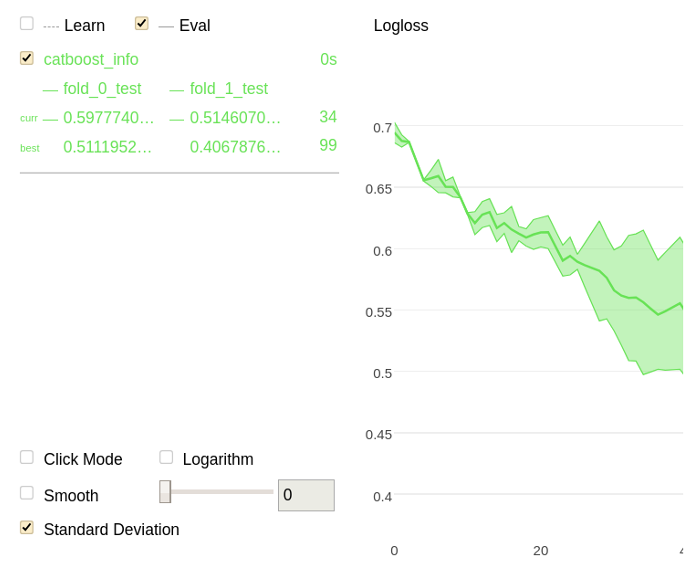

# Usage examples

## Regression {#regression}

#### [CatBoostRegressor](../concepts/python-reference_catboostregressor.md) class with array-like data

```python
from catboost import CatBoostRegressor
# Initialize data

train_data = [[1, 4, 5, 6],
              [4, 5, 6, 7],
              [30, 40, 50, 60]]

eval_data = [[2, 4, 6, 8],
             [1, 4, 50, 60]]

train_labels = [10, 20, 30]
# Initialize CatBoostRegressor
model = CatBoostRegressor(iterations=2,
                          learning_rate=1,
                          depth=2)
# Fit model
model.fit(train_data, train_labels)
# Get predictions
preds = model.predict(eval_data)

```


## Train on GPU {#train-on-gpu}

Train a classification model on GPU:
```python
from catboost import CatBoostClassifier

train_data = [[0, 3],
              [4, 1],
              [8, 1],
              [9, 1]]
train_labels = [0, 0, 1, 1]

model = CatBoostClassifier(iterations=1000,
                           task_type="GPU",
                           devices='0')
model.fit(train_data,
          train_labels,
          verbose=False)

```


## Binary classification  {#binary-classification}

#### [CatBoostClassifier](../concepts/python-reference_catboostclassifier.md) class with array-like data

```python
from catboost import CatBoostClassifier
# Initialize data
cat_features = [0, 1]
train_data = [["a", "b", 1, 4, 5, 6],
              ["a", "b", 4, 5, 6, 7],
              ["c", "d", 30, 40, 50, 60]]
train_labels = [1, 1, -1]
eval_data = [["a", "b", 2, 4, 6, 8],
             ["a", "d", 1, 4, 50, 60]]

# Initialize CatBoostClassifier
model = CatBoostClassifier(iterations=2,
                           learning_rate=1,
                           depth=2)
# Fit model
model.fit(train_data, train_labels, cat_features)
# Get predicted classes
preds_class = model.predict(eval_data)
# Get predicted probabilities for each class
preds_proba = model.predict_proba(eval_data)
# Get predicted RawFormulaVal
preds_raw = model.predict(eval_data, prediction_type='RawFormulaVal')

```

#### Load the dataset using [Pool](../concepts/python-reference_pool.md), train it with [CatBoostClassifier](../concepts/python-reference_catboostclassifier.md) and make a prediction

```python
from catboost import CatBoostClassifier, Pool

train_data = Pool(data=[[1, 4, 5, 6],
                        [4, 5, 6, 7],
                        [30, 40, 50, 60]],
                  label=[1, 1, -1],
                  weight=[0.1, 0.2, 0.3])

model = CatBoostClassifier(iterations=10)

model.fit(train_data)
preds_class = model.predict(train_data)

```

#### [CatBoostClassifier](../concepts/python-reference_catboostclassifier.md) class with array-like data with numerical, categorical and embedding features

```python
from catboost import CatBoostClassifier
# Initialize data
cat_features = [3]
embedding_features=[0, 1]
train_data = [
    [[0.1, 0.12, 0.33], [1.0, 0.7], 2, "male"],
    [[0.0, 0.8, 0.2], [1.1, 0.2], 1, "female"],
    [[0.2, 0.31, 0.1], [0.3, 0.11], 2, "female"],
    [[0.01, 0.2, 0.9], [0.62, 0.12], 1, "male"]
]
train_labels = [1, 0, 0, 1]
eval_data = [
    [[0.2, 0.1, 0.3], [1.2, 0.3], 1, "female"],
    [[0.33, 0.22, 0.4], [0.98, 0.5], 2, "female"],
    [[0.78, 0.29, 0.67], [0.76, 0.34], 2, "male"],
]

# Initialize CatBoostClassifier
model = CatBoostClassifier(iterations=2,
                           learning_rate=1,
                           depth=2)
# Fit model
model.fit(train_data, train_labels, cat_features=cat_features, embedding_features=embedding_features)
# Get predicted classes
preds_class = model.predict(eval_data)
```

#### Use [Pools](../concepts/python-reference_pool.md) with numerical, categorical and embedding features

```python
from catboost import CatBoostClassifier, Pool

train_data = Pool(
    [
        [[0.1, 0.12, 0.33], [1.0, 0.7], 2, "male"],
        [[0.0, 0.8, 0.2], [1.1, 0.2], 1, "female"],
        [[0.2, 0.31, 0.1], [0.3, 0.11], 2, "female"],
        [[0.01, 0.2, 0.9], [0.62, 0.12], 1, "male"]
    ],
    label = [1, 0, 0, 1],
    cat_features=[3],
    embedding_features=[0, 1]
)

eval_data = Pool(
    [
        [[0.2, 0.1, 0.3], [1.2, 0.3], 1, "female"],
        [[0.33, 0.22, 0.4], [0.98, 0.5], 2, "female"],
        [[0.78, 0.29, 0.67], [0.76, 0.34], 2, "male"],
    ],
    label = [0, 1, 1],
    cat_features=[3],
    embedding_features=[0, 1]
)

model = CatBoostClassifier(iterations=10)

model.fit(train_data, eval_set=eval_data)
preds_class = model.predict(eval_data)

```


## Multiclassification {#multiclassification}

```python
from catboost import Pool, CatBoostClassifier

train_data = [["summer", 1924, 44],
              ["summer", 1932, 37],
              ["winter", 1980, 37],
              ["summer", 2012, 204]]

eval_data = [["winter", 1996, 197],
             ["winter", 1968, 37],
             ["summer", 2002, 77],
             ["summer", 1948, 59]]

cat_features = [0]

train_label = ["France", "USA", "USA", "UK"]
eval_label = ["USA", "France", "USA", "UK"]


train_dataset = Pool(data=train_data,
                     label=train_label,
                     cat_features=cat_features)

eval_dataset = Pool(data=eval_data,
                    label=eval_label,
                    cat_features=cat_features)

# Initialize CatBoostClassifier
model = CatBoostClassifier(iterations=10,
                           learning_rate=1,
                           depth=2,
                           loss_function='MultiClass')
# Fit model
model.fit(train_dataset)
# Get predicted classes
preds_class = model.predict(eval_dataset)
# Get predicted probabilities for each class
preds_proba = model.predict_proba(eval_dataset)
# Get predicted RawFormulaVal
preds_raw = model.predict(eval_dataset,
                          prediction_type='RawFormulaVal')

```


## Get the best result for each metric {#get-best-score}

Return the best results for each metric calculated on the eval dataset:

```python
from catboost import CatBoostClassifier, Pool

train_data = [[0, 3],
              [4, 1],
              [8, 1],
              [9, 1]]

train_labels = [0, 0, 1, 1]

eval_data = [[2, 1],
             [3, 1],
             [9, 0],
             [5, 3]]

eval_labels = [0, 1, 1, 0]

eval_dataset = Pool(eval_data,
                    eval_labels)

model = CatBoostClassifier(learning_rate=0.03,
                           custom_metric=['Logloss',
                                          'AUC:hints=skip_train~false'])

model.fit(train_data,
          train_labels,
          eval_set=eval_dataset,
          verbose=False)

print(model.get_best_score())

```



This example illustrates the usage of the method with the [CatBoostClassifier](../concepts/python-reference_catboostclassifier.md) class. The usage with other classes is identical.




## Get the identifier of the iteration with the best result {#get-best-iteration}

Return the iteration with the best value of the evaluation metric on the eval dataset:

```python
from catboost import CatBoostClassifier, Pool

train_data = [[0, 3],
              [4, 1],
              [8, 1],
              [9, 1]]

train_labels = [0, 0, 1, 1]

eval_data = [[2, 1],
             [3, 1],
             [9, 0],
             [5, 3]]

eval_labels = [0, 1, 1, 0]

eval_dataset = Pool(eval_data,
                    eval_labels)

model = CatBoostClassifier(learning_rate=0.03,
                           eval_metric='AUC')

model.fit(train_data,
          train_labels,
          eval_set=eval_dataset,
          verbose=False)

print(model.get_best_iteration())

```




## Load the dataset from {{ python-type--list }}, {{ python-type__ndarray }}, {{ python-type--pandasDataFrame }}, {{ python-type--pandasSeries }} {#load-from-list-ndarray-dataframe-series}

#### Dataset with categorical features

```python
from catboost import Pool
cat_features = [0, 1, 2]
data = [["a","b", 1, 4, 5, 6],
        ["a","b", 4, 5, 6, 7],
        ["c","d", 30, 40, 50, 60]]

label = [1, 1, -1]

dataset = Pool(data, label, cat_features)

```

#### Dataset without categorical features

```python
from catboost import Pool
data = [[1, 4, 5, 6],
        [4, 5, 6, 7],
        [30, 40, 50, 60]]

label = [1, 1, -1]
dataset = Pool(data, label)

```

#### Dataset without labels (for prediction)

```python
from catboost import Pool
data = [[1, 4, 5, 6],
        [4, 5, 6, 7],
        [30, 40, 50, 60]]
dataset = Pool(data)

```


## Load the dataset from a file {#load-data-from-file}

#### Dataset without specified columns description (without categorical features)

```python
from catboost import Pool
dataset = Pool("data.tsv")

```

`pool_no_categ` is the file following file with the [object descriptions](../concepts/input-data_values-file.md):

```no-highlight
1	1935	01
1	1958	08
0	1969	09
```

Since the columns description file is not specified, it is assumed that the first column of the file (indexed 0) defines the label value, and all other columns are the values of numerical features.

#### Dataset with specified columns description (with categorical features)

```python
from catboost import Pool
dataset = Pool("data_with_cat_features.tsv",
               column_description="data_with_cat_features.cd")

```

- `pool` is the following file with the [object descriptions](../concepts/input-data_values-file.md):
    ```
    1935	born	1
    1958	deceased	1
    1969	born	0
    ```

- `pool.cd` is the following file with the [columns description](../concepts/input-data_column-descfile.md):
    ```no-highlight
    1	Categ
    2	Label
    ```


#### Dataset in libsvm format

1. Create a file (`data.libsvm` in this example) with the dataset in the [extended libsvm format](../concepts/input-data_libsvm.md):
    ```
    1 1:0.1 3:2.2 4:3
    0 2:0.22 3:0.82
    0 1:0.02 4:0.61
    1 3:0.72 4:0.5
    ```

1. Load the dataset:

    ```python
    from catboost import Pool
    dataset = Pool("libsvm://data.libsvm")
    ```

#### Dataset in extended libsvm format with categorical features

1. Create a file (`data_with_cat_features.libsvm` in this example) with the dataset in the [extended libsvm format](../concepts/input-data_libsvm.md):
    ```
    1 1:0.1 3:small 4:3 5:Male
    0 2:0.22 3:small 5:Female
    0 1:0.02 4:0.61 5:Female
    1 3:large 4:0.5 5:Male
    ```

1. Create the corresponding [Columns description](../concepts/input-data_column-descfile.md) file (`data_with_cat_features_for_libsvm.cd` in this example):
    ```
    0	Label
    1	Num
    2	Num
    3	Categ
    4	Num
    5	Categ
    ```

1. Load the dataset:

    ```python
    from catboost import Pool
    dataset = Pool("libsvm://data_with_cat_features.libsvm",
    column_description="data_with_cat_features_for_libsvm.cd")
    ```


## Load the dataset from sparse python data {#load-dataset-from-sparse-python-data}

#### Dataset as scipy.sparse.csr_matrix

```python
import numpy as np
import scipy.sparse

import catboost as cb


row = np.array([0, 0, 1, 2, 2, 2, 3, 3, 4])
col = np.array([0, 2, 2, 0, 1, 2, 0, 2, 2])
data = np.array([1, 2, 3, 4, 5, 6, 7, 8, 9])

X = scipy.sparse.csr_matrix((data, (row, col)), shape=(5, 3))

y = np.array([0, 1, 0, 1, 0])

dataset = cb.Pool(X, y)

```

#### Dataset as {{ python_type__pandas-SparseDataFrame }}

```python
import numpy as np
import pandas as pd

import catboost as cb

X = pd.SparseDataFrame(
    {'a': [ 1, 4, 0,  0, 1],
     'b': [ 0, 0, 1,  7, 8],
     'c': [30, 0, 0, 50, 0]
    }
)

y = np.array([0, 1, 0, 1, 1])

dataset = cb.Pool(X, y)
```

#### Dataset as pandas.DataFrame with sparse columns with categorical features

```python
import numpy as np
import pandas as pd

import catboost as cb

X = pd.DataFrame(
    {'a': pd.SparseArray([   1,   4,   0,   0,   1]),
     'b': pd.SparseArray([ 0.0, 0.0, 1.0, 7.0, 8.0]),
     'c': pd.SparseArray([  30,   0,   0,  50,   0]),
     'd': pd.SparseArray([ 'a', 'b',  '', 'c',  ''], fill_value=''),
    }
)

y = np.array([0, 1, 0, 1, 1])

dataset = cb.Pool(X, y, cat_features=['d'])
```



Specify a non-default `fill_value` for categorical feature columns with string data because the default value (`fill_value=np.NaN`) is [prohibited for categorical feature values](faq.md).




## Get a slice of a pool {#slice}

```python
from catboost import Pool

data = [[1, 3],
        [0, 4],
        [1, 7],
        [6, 4],
        [5, 3]]

dataset = Pool(data)
print(dataset.num_row())

dataset_part = dataset.slice([0, 1, 2])
print(dataset_part.num_row())

```
Get a slice of five objects from the input dataset:

Output:
```bash
5
3
```


## CV {#cv-usage-example}

Perform cross-validation on the given dataset:

```python
from catboost import Pool, cv

cv_data = [["France", 1924, 44],
           ["USA", 1932, 37],
           ["Switzerland", 1928, 25],
           ["Norway", 1952, 30],
           ["Japan", 1972, 35],
           ["Mexico", 1968, 112]]

labels = [1, 1, 0, 0, 0, 1]

cat_features = [0]

cv_dataset = Pool(data=cv_data,
                  label=labels,
                  cat_features=cat_features)

params = {"iterations": 100,
          "depth": 2,
          "loss_function": "Logloss",
          "verbose": False}

scores = cv(cv_dataset,
            params,
            fold_count=2,
            plot="True")

```




Perform cross-validation and save ROC curve points to the roc-curve output file:

```python
from catboost import Pool, cv

cv_data = [["France", 1924, 44],
           ["USA", 1932, 37],
           ["Switzerland", 1928, 25],
           ["Norway", 1952, 30],
           ["Japan", 1972, 35],
           ["Mexico", 1968, 112]]

labels = [1, 1, 0, 0, 0, 1]

cv_dataset = Pool(data=cv_data,
                  label=labels,
                  cat_features=[0])

params = {"iterations": 100,
          "depth": 2,
          "loss_function": "Logloss",
          "verbose": False,
          "roc_file": "roc-file"}

scores = cv(cv_dataset,
            params,
            fold_count=2)

```


## Using object weights {#weights}

The weight for each object in the input data can be set in the form of a one-dimensional array-like data (`length = data length`).

Weights are used to calculate the optimized loss function and metrics. By default, it is set to 1 for all objects.

```python
import numpy as np
from catboost import Pool, CatBoostClassifier
# Initialize data

train_data = np.random.randint(1, 100, size=(100, 10))
train_labels = np.random.randint(2, size=(100))
train_weight = np.random.random(100)

# Initialize Pool from data
train_dataset = Pool(train_data,
                     train_labels,
                     weight=train_weight)
# Initialize CatBoostClassifier
model = CatBoostClassifier(iterations=10)
# Fit model
model.fit(train_dataset)
```


## Using best model {#best-model}







The `eval_set` parameter is obligatory for the `fit` method if the best model mode is on.

```python
from catboost import Pool, CatBoostClassifier

train_data = [["France", 1924, 44],
              ["USA", 1932, 37],
              ["USA", 1980, 37]]

eval_data = [["USA", 1996, 197],
             ["France", 1968, 37],
             ["USA", 2002, 77]]

cat_features = [0]

train_label = [1, 1, 0]
eval_label = [0, 0, 1]

train_dataset = Pool(data=train_data,
                     label=train_label,
                     cat_features=cat_features)

eval_dataset = Pool(data=eval_data,
                    label=eval_label,
                    cat_features=cat_features)

# Initialize CatBoostClassifier
model = CatBoostClassifier(iterations=100)
# Fit model with `use_best_model=True`

model.fit(train_dataset,
          use_best_model=True,
          eval_set=eval_dataset)

print("Count of trees in model = {}".format(model.tree_count_))

```


## Load the model from a file {#load-from-file}

The following example illustrates how to save a trained model to a file and then load it.

```python
from catboost import CatBoostClassifier, Pool

train_data = [[1, 3],
              [0, 4],
              [1, 7]]
train_labels = [1, 0, 1]

# catboost_pool = Pool(train_data, train_labels)

model = CatBoostClassifier(learning_rate=0.03)
model.fit(train_data,
          train_labels,
          verbose=False)

model.save_model("model")

from_file = CatBoostClassifier()

from_file.load_model("model")

```


## Using staged_predict {#staged-predict}

The values of the model can be output for each i-th tree of the model by taking into consideration only the trees in the range `[1;i – 1]`.

```python
from catboost import Pool, CatBoostClassifier

train_data = [["France", 1924, 44],
              ["USA", 1932, 37],
              ["USA", 1980, 37]]

eval_data = [["USA", 1996, 197],
             ["France", 1968, 37],
             ["USA", 2002, 77]]

cat_features = [0]
train_label = [1, 1, 0]
eval_label = [0, 0, 1]

train_dataset = Pool(data=train_data,
                     label=train_label,
                     cat_features=cat_features)
eval_data = Pool(data=eval_data,
                 label=eval_label,
                 cat_features=cat_features)

# Initialize CatBoostClassifier
model = CatBoostClassifier(iterations=100)
# Fit model
model.fit(train_dataset)

# Get staged_predictions
# First method: use predict() with `ntree_end` in loop
staged_predictions_brute_force = []

for i in range(1, model.tree_count_ + 1):
    staged_predictions_brute_force.append(model.predict(eval_data,
                                                        ntree_end=i))

# Second method: It is equivalent to the previous, but faster
staged_predictions = list(model.staged_predict(eval_data))

```


## Using pre-training results (baseline) {#baseline}

A pre-trained model can be used. The results (only raw_values, not probability or class) can be set as baseline for the new model.

The form of the baseline depends on the machine learning problem being solved:
- Multiclass classification — a two-dimensional array: `shape = (length of data, number of classes)`
- Regression, binary classification, ranking— a one-dimensional array.

```python
import numpy as np
from sklearn.linear_model import Ridge
from sklearn.metrics import mean_squared_error
from catboost import CatBoostRegressor, Pool
from catboost.datasets import msrank
from sklearn.model_selection import train_test_split

# Download train and validation datasets
train_df, test_df = msrank()
#Column 0 contains label values, column 1 contains group ids.
X_train, y_train = train_df.drop([0, 1], axis=1).values, train_df[0].values
X_test, y_test = test_df.drop([0, 1], axis=1).values, test_df[0].values

# Split train data into two parts. First part - for baseline model,
# second part - for major model
splitted_data = train_test_split(X_train, y_train, test_size=0.5)
X_train_first, X_train_second, y_train_first, y_train_second = splitted_data

catboost_model = CatBoostRegressor(iterations=200, verbose=False)

##########################################
######### SIMPLE BASELINE MODEL ##########
##########################################

# Prepare simple baselines (just mean target on first part of train pool).
baseline_value = y_train_first.mean()
train_baseline = np.array([baseline_value] * y_train_second.shape[0])
test_baseline = np.array([baseline_value] * y_test.shape[0])

# Create pools
train_pool = Pool(X_train_second, y_train_second, baseline=train_baseline)
test_pool = Pool(X_test, y_test, baseline=test_baseline)

# Train CatBoost model
catboost_model.fit(train_pool, eval_set=test_pool)

# Apply model on pool with baseline values
preds1 = catboost_model.predict(test_pool)

# Apply model on numpy.ndarray and then add the baseline values
preds2 = test_baseline + catboost_model.predict(X_test)

# Check that preds have small diffs
assert (np.abs(preds1 - preds2) < 1e-6).all()

print(mean_squared_error(y_test, preds1))

##########################################
######### LINEAR BASELINE MODEL ##########
##########################################

# Train baseline model (linear regression) on first part of train pool
baseline_model = Ridge(alpha=3e3, normalize=True)
baseline_model.fit(X_train_first, y_train_first)

# Prepare baselines
train_baseline = baseline_model.predict(X_train_second)
test_baseline = baseline_model.predict(X_test)

# Create pools
train_pool = Pool(X_train_second, y_train_second, baseline=train_baseline)
test_pool = Pool(X_test, y_test, baseline=test_baseline)

# Train CatBoost model
catboost_model.fit(train_pool, eval_set=test_pool)

# Apply model on pool with baseline values
preds1 = catboost_model.predict(test_pool)

# Apply model on numpy.ndarray and then add the baseline values
preds2 = baseline_model.predict(X_test) + catboost_model.predict(X_test)

# Check that preds have small diffs
assert (np.abs(preds1 - preds2) < 1e-6).all()

print(mean_squared_error(y_test, preds1))
```


## Training continuation {#training-continuation}

```python
from catboost import CatBoostRegressor

# Initialize data

train_data = [[1, 4, 5, 6],
              [4, 5, 6, 7],
              [30, 40, 50, 60]]

eval_data = [[2, 4, 6, 8],
             [1, 4, 50, 60]]

train_labels = [10, 20, 30]


# initial parameters

model1 = CatBoostRegressor(iterations=2,
                           learning_rate=0.2,
                           depth=2)

model1.fit(train_data, train_labels)

# continue training with the same parameters, result will be in updated model1

model1.fit(train_data, train_labels, init_model=model1)


# continue training with different parameters

model2 = CatBoostRegressor(iterations=4,
                           learning_rate=0.1,
                           depth=4)

# result will be in model2, model1 will be unchanged

model2.fit(train_data, train_labels, init_model=model1)

```


## Batch training {#batch-training}

```python
from catboost import (CatBoostRegressor, Pool, sum_models,)

# Initialize data

train_data1 = [[1, 4, 5, 6],
                [4, 5, 6, 7],
                [30, 40, 50, 60]]
train_labels1 = [10, 20, 30]

train_data2 = [[2, 4, 6, 8],
                [41, 14, 56, 65],
                [1, 4, 50, 60]]
train_labels2 = [17, 23, 73]


# training parameters

params = {
    'task_type': 'GPU',
    'iterations': 2,
    'learning_rate': 0.2,
    'depth': 2
}

model1 = CatBoostRegressor(**params)
batch1 = Pool(train_data1, label=train_labels1)
model1.fit(X=batch1)

# continue training with different portion of data

model2 = CatBoostRegressor(**params)
batch2 = Pool(train_data2, label=train_labels2)
batch2.set_baseline(model1.predict(batch2))
model2.fit(X=batch2)

# build resulting model

model = sum_models([model1, model2])
```


## Exporting the model to Apple CoreML {#exporting-to-apple-core-ml}




## Object strength calculation {#python-ostr}

Calculate the `train_pool` objects strength for the `pool` objects:
```python
from catboost import Pool, CatBoost

train_data = [["France", 1924, 44],
              ["USA", 1932, 37],
              ["USA", 1980, 37]]

data = [["USA", 1996, 197],
        ["France", 1968, 37],
        ["USA", 2002, 77]]


cat_features = [0]
train_label = [1, 1, 0]
label = [0, 0, 1]

train_dataset = Pool(data=train_data,
                     label=train_label,
                     cat_features=cat_features)

dataset = Pool(data=data,
               cat_features=cat_features,
               label=label)

cb = CatBoost({'iterations': 10})
cb.fit(train_dataset)
indices, scores = cb.get_object_importance(dataset,
                                           train_dataset,
                                           top_size=100)

```


## User-defined loss function {#user-defined-loss-function}

To set a user-defined loss function, create an object that implements the following interface:

```python
class UserDefinedObjective(object):
    def calc_ders_range(self, approxes, targets, weights):
        # approxes, targets, weights are indexed containers of floats
        # (containers which have only __len__ and __getitem__ defined).
        # weights parameter can be None.
        #
        # To understand what these parameters mean, assume that there is
        # a subset of your dataset that is currently being processed.
        # approxes contains current predictions for this subset,
        # targets contains target values you provided with the dataset.
        #
        # This function should return a list of pairs (-der1, -der2), where
        # der1 is the first derivative of the loss function with respect
        # to the predicted value, and der2 is the second derivative.
        pass

class UserDefinedMultiClassObjective(object):
    def calc_ders_multi(self, approxes, target, weight):
        # approxes - indexed container of floats with predictions
        #            for each dimension of single object
        # target - contains a single expected value
        # weight - contains weight of the object
        #
        # This function should return a tuple (-der1, -der2), where
        # - der1 is a list-like object of first derivatives of the loss function with respect
        # to the predicted value for each dimension.
        # - der2 is a matrix of second derivatives.
        pass
```

Examples:

#### {{ error-function--Logit }}




```python
class LoglossObjective(object):
    def calc_ders_range(self, approxes, targets, weights):
        assert len(approxes) == len(targets)
        if weights is not None:
            assert len(weights) == len(approxes)

        result = []
        for index in range(len(targets)):
            e = np.exp(approxes[index])
            p = e / (1 + e)
            der1 = targets[index] - p
            der2 = -p * (1 - p)

            if weights is not None:
                der1 *= weights[index]
                der2 *= weights[index]

            result.append((der1, der2))
        return result
```




```python
model = CatBoostClassifier(loss_function=LoglossObjective())
```

#### {{ error-function--RMSE }}




```python
class RmseObjective(object):
    def calc_ders_range(self, approxes, targets, weights):
        assert len(approxes) == len(targets)
        if weights is not None:
            assert len(weights) == len(approxes)

        result = []
        for index in range(len(targets)):
            der1 = targets[index] - approxes[index]
            der2 = -1

            if weights is not None:
                der1 *= weights[index]
                der2 *= weights[index]

            result.append((der1, der2))
        return result
```




```python
model = CatBoostRegressor(loss_function=RmseObjective())
```

#### {{ error-function--MultiClass }}




```python
class MultiClassObjective(object):
    def calc_ders_multi(self, approx, target, weight):
        approx = np.array(approx) - max(approx)
        exp_approx = np.exp(approx)
        exp_sum = exp_approx.sum()
        grad = []
        hess = []
        for j in range(len(approx)):
            der1 = -exp_approx[j] / exp_sum
            if j == target:
                der1 += 1
            hess_row = []
            for j2 in range(len(approx)):
                der2 = exp_approx[j] * exp_approx[j2] / (exp_sum**2)
                if j2 == j:
                    der2 -= exp_approx[j] / exp_sum
                hess_row.append(der2 * weight)

            grad.append(der1 * weight)
            hess.append(hess_row)

        return (grad, hess)

```




```python
model = CatBoostClassifier(loss_function=MultiClassObjective())
```


## User-defined metric for overfitting detector and best model selection {#custom-loss-function-eval-metric}

To set a user-defined metric for overfitting detector and best model selection, create an object that implements the following interface:

```python
class UserDefinedMetric(object):
    def is_max_optimal(self):
        # Returns whether great values of metric are better
        pass

    def evaluate(self, approxes, target, weight):
        # approxes is a list of indexed containers
        # (containers with only __len__ and __getitem__ defined),
        # one container per approx dimension.
        # Each container contains floats.
        # weight is a one dimensional indexed container.
        # target is a one dimensional indexed container.

        # weight parameter can be None.
        # Returns pair (error, weights sum)
        pass

    def get_final_error(self, error, weight):
        # Returns final value of metric based on error and weight
        pass
```

Implementation examples:

#### {{ error-function--Logit }}




```python
class LoglossMetric(object):
    def get_final_error(self, error, weight):
        return error / (weight + 1e-38)

    def is_max_optimal(self):
        return False

    def evaluate(self, approxes, target, weight):
        assert len(approxes) == 1
        assert len(target) == len(approxes[0])

        approx = approxes[0]

        error_sum = 0.0
        weight_sum = 0.0

        for i in range(len(approx)):
            e = np.exp(approx[i])
            p = e / (1 + e)
            w = 1.0 if weight is None else weight[i]
            weight_sum += w
            error_sum += -w * (target[i] * np.log(p) + (1 - target[i]) * np.log(1 - p))

        return error_sum, weight_sum
```




```python
model = CatBoostClassifier(eval_metric=LoglossMetric())
```

#### {{ error-function--RMSE }}




```python
class RmseMetric(object):
    def get_final_error(self, error, weight):
        return np.sqrt(error / (weight + 1e-38))

    def is_max_optimal(self):
        return False

    def evaluate(self, approxes, target, weight):
        assert len(approxes) == 1
        assert len(target) == len(approxes[0])

        approx = approxes[0]

        error_sum = 0.0
        weight_sum = 0.0

        for i in range(len(approx)):
            w = 1.0 if weight is None else weight[i]
            weight_sum += w
            error_sum += w * ((approx[i] - target[i])**2)

        return error_sum, weight_sum
```




```python
model = CatBoostRegressor(eval_metric=RmseMetric())
```

#### {{ error-function--Accuracy }}




```python
class AccuracyMetric(object):
    def get_final_error(self, error, weight):
        return error / (weight + 1e-38)

    def is_max_optimal(self):
        return True

    def evaluate(self, approxes, target, weight):
        best_class = np.argmax(approxes, axis=0)

        accuracy_sum = 0
        weight_sum = 0

        for i in range(len(target)):
            w = 1.0 if weight is None else weight[i]
            weight_sum += w
            accuracy_sum += w * (best_class[i] == target[i])

        return accuracy_sum, weight_sum
```




```python
model = CatBoostClassifier(eval_metric=AccuracyMetric())
```
