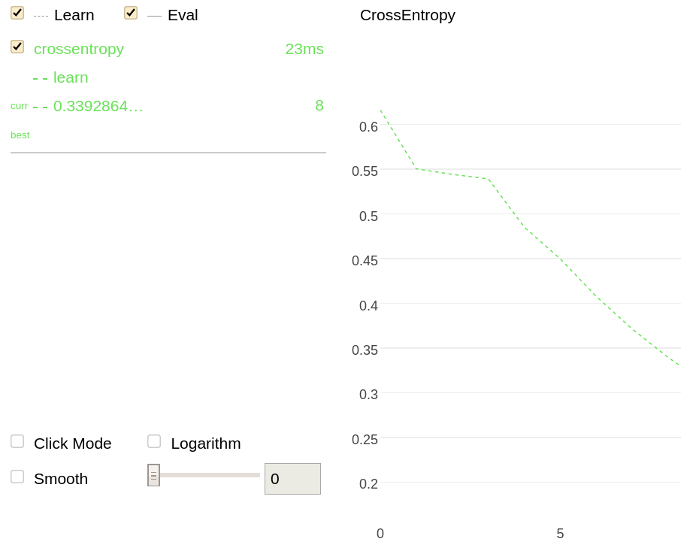

# Jupyter Notebook

[Additional packages for data visualization support](../installation/python-installation-additional-data-visualization-packages.md) must be installed to plot charts in [Jupyter Notebook](http://jupyter.org/).

Several charts reflecting different aspects of model training and analysis can be plotted in Jupyter Notebook. Choose the suitable case and refer to examples for implementation details.

## Add a training parameter {#fit-parameter}

It is possible to plot a chart while training by setting the `plot` parameter to <q>True</q>. This approach is applicable for the following methods:
- [fit](../concepts/python-reference_catboost_fit.md) ([CatBoost](../concepts/python-reference_catboost.md) class)
- [fit](../concepts/python-reference_catboostclassifier_fit.md) ([CatBoostClassifier](../concepts/python-reference_catboostclassifier.md) class)
- [fit](../concepts/python-reference_catboostregressor_fit.md) ([CatBoostRegressor](../concepts/python-reference_catboostregressor.md) class)


## Add a training a model using

```python
from catboost import CatBoostClassifier, Pool

train_data = [[1, 3], [0, 4], [1, 7], [0, 3]]
train_labels = [1, 0, 1, 1]

model = CatBoostClassifier(learning_rate=0.03)

model.fit(train_data,
       train_labels,
       verbose=False,
       plot=True)

```
 

## Read data from the specified directory only using MetricVisualizer {#specified-catalog-only}

```python
import catboost

w = catboost.MetricVisualizer('/path/to/trains/1')
w.start()
```

Refer to the [MetricVisualizer](../concepts/python-reference_catboostipythonwidget.md) section for details.

## Gather data from the specified directory only

1. Train a model from the root of the file system (`/`):
```python
 from catboost import CatBoostClassifier

cat_features = [0,1,2]

train_data = [["a", "b", 1, 4, 5, 6],
["a", "b", 4, 5, 6, 7],
["c", "d", 30, 40, 50, 60]]

train_labels = [1,1,0]

model = CatBoostClassifier(iterations=20,
loss_function = "CrossEntropy",
train_dir = "crossentropy")

model.fit(train_data, train_labels, cat_features)
predictions = model.predict(train_data)
```

1. Plot a chart using the information regarding the previous training (from the `crossentropy` directory):

```
import catboost

w = catboost.MetricVisualizer('/crossentropy/')
w.start()
```





## Gather and read data from all subdirectories of the specified directory using MetricVisualizer {#all-subfolders}

```python
import catboost

w = catboost.MetricVisualizer('/path/to/trains', subdirs=True)
w.start()
```

Any data located directly in the `/path/to/trains` folder is ignored. The information is read from its' subdirectories only.

Refer to the [MetricVisualizer](../concepts/python-reference_catboostipythonwidget.md) section for details.

## Gather and read data from all subdirectories

1. Train two models from the root of the file system (`/`):
 1. ```python
     from catboost import CatBoostClassifier

     cat_features = [0,1,2]

     train_data = [["a", "b", 1, 4, 5, 6],
     ["a", "b", 4, 5, 6, 7],
     ["c", "d", 30, 40, 50, 60]]

     train_labels = [1,1,0]

     model = CatBoostClassifier(iterations=20,
     loss_function = "CrossEntropy",
     train_dir = "crossentropy")

     model.fit(train_data, train_labels, cat_features)
     predictions = model.predict(train_data)
  ```
1.  ```python
     from catboost import CatBoostClassifier

     cat_features = [0,1,2]

     train_data = [["a", "b", 1, 4, 5, 6],
     ["a", "b", 4, 5, 6, 7],
     ["c", "d", 30, 40, 50, 60]]

     train_labels = [1,1,0]

     model = CatBoostClassifier(iterations=20,
     train_dir = "logloss")

     model.fit(train_data, train_labels, cat_features)
     predictions = model.predict(train_data)
  ```

1. Plot charts using the information from all subdirectories (`crossentropy` and `logloss`) of the root of the file system:
```python
import catboost

w = catboost.MetricVisualizer('/', subdirs=True)
w.start()
```




# Perform cross-validation



## Grid search {#grid-search}

It is possible to plot a chart when performing a simple grid search over specified parameter values for a model. To do this, the  `plot` parameter must be set to <q>True</q> for one of the methods that performs the grid search:
- [grid_search](../concepts/python-reference_catboost_grid_search.md) ([CatBoost](../concepts/python-reference_catboost.md) class)
- [grid_search](../concepts/python-reference_catboostclassifier_grid_search.md) ([CatBoostClassifier](../concepts/python-reference_catboostclassifier.md) class)
- [grid_search](../concepts/python-reference_catboostregressor_grid_search.md) ([CatBoostRegressor](../concepts/python-reference_catboostregressor.md) class)

Use the following code in Jupyter Notebook:



## Randomized search {#random-search}

It is possible to plot a chart when performing a simple randomized search on hyperparameters. To do this, the  `plot` parameter must be set to <q>True</q> for one of the methods that performs the grid search:
- [randomized_search](../concepts/python-reference_catboost_randomized_search.md) ([CatBoost](../concepts/python-reference_catboost.md) class)
- [randomized_search](../concepts/python-reference_catboostclassifier_randomized_search.md) ([CatBoostClassifier](../concepts/python-reference_catboostclassifier.md) class)
- [randomized_search](../concepts/python-reference_catboostregressor_randomized_search.md) ([CatBoostRegressor](../concepts/python-reference_catboostregressor.md) class)



## Feature statistics {#feature-statistics}

А set of statistics for the chosen feature can be calculated and plotted.

Use one of the following methods to do this:
- [calc_feature_statistics](../concepts/python-reference_catboost_calc_feature_statistics.md) ([CatBoost](../concepts/python-reference_catboost.md) class)
- [calc_feature_statistics](../concepts/python-reference_catboostclassifier_calc_feature_statistics.md) ([CatBoostClassifier](../concepts/python-reference_catboostclassifier.md) class)
- [calc_feature_statistics](../concepts/python-reference_catboostregressor_calc_feature_statistics.md) ([CatBoostRegressor](../concepts/python-reference_catboostregressor.md) class)


