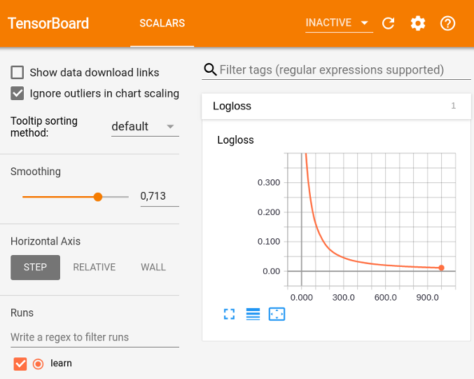

# TensorBoard

Run the following command to plot a chart of the [metric](../concepts/loss-functions.md) value dynamics in [TensorBoard](https://www.tensorflow.org/get_started/summaries_and_tensorboard) during the training procedure:

```
tensorboard --logdir=<train_dir>
```

`train_dir` is the directory for storing the files generated during training. This directory is specified in the training parameters.

## {{ title__example_plotted_chart }}



